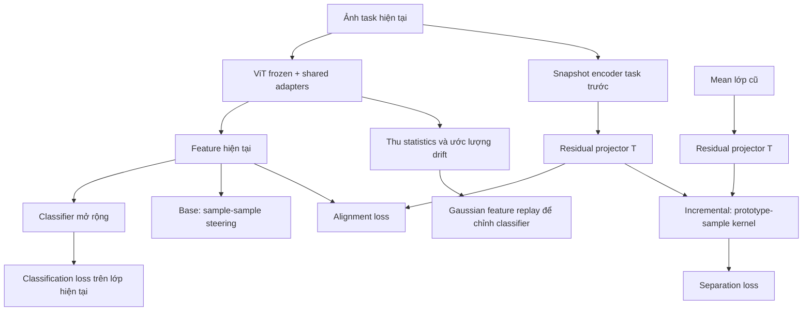

# QKSR trong RSIAT — hiểu bài toán, từng bước tính và câu hỏi nghiên cứu

*Cập nhật 02/10/2026. Tài liệu học và chuẩn bị báo cáo; đối chiếu implementation hiện tại, chủ yếu với cấu hình CIFAR100 trong repository.*

## 0. Đọc trước: QKSR muốn làm gì?

**QKSR thử thay cách đo độ giống nhau trong representation-steering loss của RSIAT bằng một projected local quantum kernel.** Mục tiêu là tạo tín hiệu học hữu ích hơn cho bài toán nhận biết lớp mới mà vẫn giữ khả năng nhận biết lớp cũ.

Ba câu cần phân biệt:

1. **Đã triển khai:** projection classical → Ry–CNOT simulator → local RDM → RBF similarity → loss.
2. **Giả thuyết:** metric này có thể tạo representation phù hợp hơn cosine hoặc nonlinear classical metrics.
3. **Chưa chứng minh:** cải thiện ổn định trên full incremental sequence, lợi ích riêng của circuit, hay quantum advantage.

Module QKSR phục vụ **huấn luyện**. Khi dự đoán ảnh mới, đường tính vẫn là ViT + adapter + classifier; không tính quantum kernel.

Nếu ket, RDM hoặc partial trace còn khó hiểu, đọc [QML_FOUNDATIONS_FOR_QKSR.md](QML_FOUNDATIONS_FOR_QKSR.md) trước. Ở đây, mỗi công thức sẽ được giải thích theo câu hỏi nó cần giải quyết.

### Bản đồ đọc

| Phần | Nội dung | Dùng khi báo cáo |
|---|---|---|
| §1–3 | Bài toán, baseline, ký hiệu | Giới thiệu vấn đề và phương pháp gốc |
| §4–6 | Feature map và base task | Giải thích contribution đang thử |
| §7–10 | Memory, incremental loss, drift, CA | Trả lời QKSR giúp lớp cũ thế nào |
| §11–13 | Code/config, giả thuyết, thực nghiệm | Phân biệt implementation với evidence |
| §14–16 | Kịch bản báo cáo và câu hỏi | Chuẩn bị trao đổi với giảng viên |

## 1. Bài toán gốc: tại sao không chỉ train classifier bình thường?

### 1.1 Một ví dụ nhỏ

Giả sử task 0 có ảnh mèo và chó. Task 1 chỉ có ảnh chim và cá. Sau task 1, model vẫn phải chọn nhãn trong **mèo, chó, chim, cá**. Khi nhận một ảnh test, không ai nói nó thuộc task nào.

Nếu chỉ tối ưu loss trên chim/cá, representation có thể đổi theo cách thuận lợi cho hai lớp này nhưng làm mèo/chó khó phân biệt. Hiện tượng giảm năng lực trên dữ liệu đã học được gọi là **catastrophic forgetting**.

Việc backbone pretrained đã mạnh giúp giảm khó khăn, nhưng không loại bỏ forgetting: adapter và head vẫn thay đổi.

### 1.2 Viết bằng ký hiệu để tổng quát hóa

Task t cung cấp dataset $\mathcal D_t=\{(x_i,y_i)\}_{i=1}^{N_t}$, với labels trong tập lớp mới $\mathcal C_t$. Các tập lớp khác task không giao nhau.

Sau task t, phải dự đoán trên:

$$
\mathcal C_{\le t}=\bigcup_{s=0}^{t}\mathcal C_s.
$$

Phép union ở đây chỉ có nghĩa “tất cả lớp đã gặp”. Task index bắt đầu từ 0 trong repo.

CIFAR100 config hiện tại bắt đầu với 10 lớp, rồi mỗi task thêm 10 lớp: tổng cộng 10 task, index 0–9. Class IDs đã được sắp theo class order của run; không nhất thiết là thứ tự tên lớp gốc.

### 1.3 Exemplar-free nghĩa là không còn thông tin cũ sao?

Không. Nó có nghĩa learner không lưu ảnh cũ để replay. Repo vẫn giữ:

- snapshot model task trước để tạo teacher features;
- mean và covariance feature của từng lớp;
- classifier weights, shared adapter và các trạng thái cần cho training.

**Không lưu ảnh cũ** khác với **không dùng memory**. Thống kê feature vẫn chiếm bộ nhớ và có thể tăng theo số lớp.

Một mean không chứa toàn bộ dataset. Nếu hai cụm dữ liệu có cùng mean/covariance nhưng khác hình dạng, memory này không phân biệt được chúng hoàn toàn. Đó là một giới hạn của mô hình hóa, không phải lỗi công thức.

## 2. RSIAT nền: mỗi thành phần giải quyết việc gì?

RSIAT dùng một bộ adapter chung xuyên suốt các task trong ViT pretrained. “Một bộ” gồm adapter ở nhiều Transformer blocks, không phải một layer nhỏ duy nhất. Backbone pretrained được frozen; các trọng số được phép học chủ yếu nằm ở adapters, classifier và projector phụ trợ.

### 2.1 Ba thành phần cần phân biệt

| Thành phần | Input → output | Mục đích |
|---|---|---|
| Feature extractor $f_{\phi_t}$ | Ảnh → vector 768 chiều | Biểu diễn ảnh phục vụ phân loại |
| Classifier $g_t$ | Feature → scores của các lớp đã gặp | Ra quyết định nhãn |
| Residual projector $T_\omega$ | Feature 768 chiều → feature 768 chiều | Nối feature cũ với feature hiện tại khi adapter đổi |

$\phi_t$ chỉ phần tham số thích nghi của encoder; không có nghĩa toàn bộ ViT pretrained được fine-tune.

QKSR bổ sung **một projector khác**, $P_\eta$: 768 chiều → q góc. Trong tài liệu này:

- $T_\omega$: projector/autoencoder của **RSIAT**, code `old_ae`.
- $P_\eta$: projector classical nằm trong **quantum metric**, code `ClassicalProjector`.

Hai module có mục đích, shape và lifecycle khác nhau. Đừng gọi chung cả hai là “quantum projector”.

### 2.2 Tại sao cần representation steering ngoài classification loss?

Classification loss yêu cầu score nhãn đúng cao hơn nhãn sai. Nhưng nhiều cấu trúc feature khác nhau vẫn có thể cho cùng accuracy trên những lớp đang có.

Representation steering bổ sung sở thích về geometry: các mẫu cùng lớp nên gần nhau; các mẫu cần phân biệt không nên quá giống. Hy vọng là cấu trúc này dễ duy trì hơn khi thêm lớp.

Đó là **regularization/inductive bias**, không phải định lý bảo đảm ít forgetting. Ép quá mạnh có thể làm model khó thích nghi lớp mới.

### 2.3 Bản đồ tổng thể



Diagram mô tả `old_proj` mặc định. Quantum kernel nằm trong B và Q khi các flag tương ứng bật. Base task không có snapshot/old prototypes để chạy nhánh incremental.

## 3. Ký hiệu dùng xuyên suốt

| Ký hiệu | Ý nghĩa |
|---|---|
| x, y | Ảnh và nhãn |
| t, e | Task index và epoch index |
| B, d | Minibatch size; feature dimension d=768 |
| $z=f_{\phi_t}(x)$ | Feature từ encoder hiện tại |
| $z^-=f_{\phi_{t-1}}(x)$ | Feature của **cùng ảnh hiện tại** qua encoder cũ |
| $\mu_c,\Sigma_c$ | Mean và covariance được lưu cho lớp c |
| $T_\omega$ | Residual projector 768→768 của RSIAT |
| $P_\eta$, a | Classical quantum-projector và vector q góc |
| q, L | Số qubit và số circuit layers |
| $\theta$ | Góc trainable của circuit; khác góc dữ liệu a |
| $\rho_k$, r | RDM của qubit k; vector hóa RDM features |
| D, K | Squared distance; kernel similarity |
| $\gamma_Q$ | Bandwidth của quantum/RBF kernel |
| $\beta,\lambda_{\mathrm{sep}}$ | Trọng số alignment và incremental separation |
| $\alpha,\lambda_{\mathrm{RS}}$ | Cân bằng negative term; trọng số base steering |
| $m_{\mathrm{cls}},m_Q,m_{\mathrm{inc}}$ | Ba margin khác nhau: classifier, base pairs, incremental pairs |

**Chú ý khóa config:** `gamma` của RSIAT ánh xạ tới $\lambda_{\mathrm{sep}}$, còn thuộc tính `quantum_kernel.gamma` là $\gamma_Q$. Dùng ký hiệu tách biệt tránh nhầm “tăng gamma” đang tăng loss weight hay thay độ nhạy kernel.

## 4. Từ feature ảnh đến quantum similarity

### 4.1 Bài toán của module

Input là hai tập feature, ví dụ B ảnh hoặc C prototypes và B ảnh. Output là một ma trận độ giống, không phải nhãn hay probability cùng lớp.

Một mẫu đi qua:

$$
z\in\mathbb R^{768}
\xrightarrow{P_\eta}a\in(-\pi,\pi)^q
\xrightarrow{\mathrm{circuit}}|\psi\rangle\in\mathbb R^{2^q}
\xrightarrow{\mathrm{partial\ trace}}R.
$$

Hai RDM representations được so sánh để tạo D, rồi K. Nền tảng quantum của từng mũi tên có ví dụ tính tay trong tài liệu foundations.

### 4.2 Vì sao LayerNorm → linear → tanh?

Trên từng vector z, tính mean và variance theo d tọa độ:

$$
\bar z_j=\frac{z_j-\mu_z}{\sqrt{v_z+\epsilon_{\mathrm{LN}}}},
\quad
\mu_z=\frac1d\sum_{j=1}^d z_j,
\quad
v_z=\frac1d\sum_{j=1}^d(z_j-\mu_z)^2.
$$

Trong công thức đầu, $\bar z_j$ là tọa độ đã chuẩn hóa; $\mu_z$ là mean vô hướng của các tọa độ thuộc một sample, khác mean lớp $\mu_c$. LN trong code không có affine scale/bias trainable.

Sau đó:

$$
a=\pi\tanh(W\operatorname{LN}(z)+b),
\quad W\in\mathbb R^{q\times768},\quad b\in\mathbb R^q.
$$

- LN giảm nhạy với scale của feature đầu vào.
- Linear học tổ hợp các chiều hữu ích.
- q nhỏ giữ simulator khả thi.
- tanh giới hạn góc, nhưng có thể bão hòa gradient.
- Đây là nén học được, không bảo toàn toàn bộ thông tin 768 chiều.

Với q=8, riêng W,b có $8(768+1)=6.152$ tham số. Phần “classical trước circuit” lớn hơn nhiều so với 16 circuit angles; phải có ablation để biết phần nào tạo lợi ích.

### 4.3 Circuit: viết truy hồi để không nhầm thứ tự

Đặt $E(a)=\bigotimes_jR_y(a_j)$ là encoding, $V_l=\bigotimes_jR_y(\theta_{l,j})$ là variational layer, C là vòng CNOT theo đúng thứ tự control tăng dần.

Không reupload:

$$
|\psi^{(0)}\rangle=E(a)|0\rangle^{\otimes q},
\qquad
|\psi^{(l+1)}\rangle=CV_l|\psi^{(l)}\rangle,\quad l=0,\ldots,L-1.
$$

Trong tích $CV_l$, $V_l$ tác động trước. Nếu reupload, bắt đầu bằng zero state và mỗi bước dùng $CV_lE(a)$.

Code hiện cho q từ 2 đến 12, L từ 1 đến 3. Cấu hình CIFAR đang khảo sát q=8, L=2, `q_reupload=false`.

### 4.4 Vì sao dùng local RDM?

Statevector có thông tin toàn hệ; local RDM chọn đọc một phần cấu trúc ấy với số phần tử nhỏ. Với order 1, giữ q ma trận 2×2. Với order 2, thêm q ma trận 4×4 của các cặp vòng $(k,(k+1)\bmod q)$.

$$
D_1(z,z')=\sum_k\|\rho_k(z)-\rho_k(z')\|_F^2,
$$

$$
D_2(z,z')=D_1(z,z')
+\lambda_2\sum_k\|\rho_{k,k+1}(z)-\rho_{k,k+1}(z')\|_F^2.
$$

Chỉ số cặp hiểu theo modulo q. Norm Frobenius là cộng bình phương chênh từng ô. Nó đo khác biệt của local states; không đo trực tiếp quên lớp hay semantic distance.

Two-body giữ thêm correlation nhưng không phải toàn bộ correlation. Riêng q=2, code lấy cả cặp (0,1) và (1,0); chúng chứa cùng thông tin với thứ tự subsystem đổi, nên phần pair distance bị đếm hai lần. Cần nhớ khi đối chiếu ví dụ nhỏ với code.

### 4.5 Vì sao RBF và gamma calibration?

$$
K(z,z')=\exp[-\gamma_QD(z,z')].
$$

Hàm mũ đổi distance thành similarity trơn trong (0,1], để loss dễ dùng. Đây vẫn là RBF classical, chỉ khác feature map đầu vào. Nó không phải full-state fidelity.

Median heuristic đặt $\gamma_0=1/\operatorname{median}(D)$ khi median hợp lệ; typical distance lúc đầu cho K≈$e^{-1}$. Nếu distances suy biến, code fallback $\gamma_0=1$. Với bounded learned mode:

$$
\gamma_Q=\gamma_0\,10^{\tanh u}.
$$

u=0 cho gamma ban đầu; u học được điều chỉnh trong cận hệ số 0,1–10. Code thêm numerical floor bằng mixture với constant kernel, xem foundations §12.

Calibration dùng subset train với deterministic evaluation transforms. Nó chạy **một lần khi module được dùng lần đầu**, trừ khi chủ động force; không mặc định recalibrate mỗi task. Khi lần đầu dùng ở incremental task, calibration dùng cross-distance prototype–sample và không bỏ diagonal.

### 4.6 Shape để tự kiểm tra hiểu biết

| Bước | Base batch B=64, q=8 |
|---|---|
| Encoder features | 64×768 |
| Projected angles | 64×8 |
| Statevectors | 64×256 |
| One-body RDM | 64×8×2×2 |
| Two-body bổ sung nếu order 2 | 64×8×4×4 |
| Self-kernel | 64×64 |
| Cross-kernel nếu có 40 old classes | 40×64 |

Một matrix 64×64 không có nghĩa chạy circuit 4.096 lần. Code encode mỗi sample rồi tính mọi pairwise distances. Tuy nhiên tensor chênh lệch pairwise vẫn có thể chiếm nhiều bộ nhớ.

## 5. Classification loss: phần quyết định nhãn đến từ đâu?

### 5.1 Từ feature tới score

Classifier có vector trọng số $w_c$ cho lớp c. Repo chuẩn hóa feature và weight trước khi lấy inner product:

$$
s_c(z)=\frac{w_c^Tz}{\|w_c\|_2\|z\|_2}.
$$

Đây là cosine score, không phải output của quantum module. Head và prototype khác nhau: **head weights được optimizer học**, prototype là mean feature tính từ dữ liệu; không được mặc định hai vector bằng nhau.

### 5.2 CosFace là cross-entropy có margin trên score nhãn đúng

Cross-entropy yêu cầu xác suất nhãn đúng cao. CosFace khiến yêu cầu khó hơn bằng cách trừ margin ở score đúng trước softmax:

$$
L_{\mathrm{cls},i}
=-\log
\frac{\exp[s(s_{y_i}(z_i)-m_{\mathrm{cls}})]}
{\exp[s(s_{y_i}(z_i)-m_{\mathrm{cls}})]
+\sum_{c\in\mathcal C_t,\ c\ne y_i}\exp[s\,s_c(z_i)]}.
$$

s là scale, không phải task index. Lấy trung bình theo batch để ra $L_{\mathrm{cls}}$.

**Tại sao trừ margin?** Model phải tăng cosine đúng cao hơn trước để đạt cùng probability, tạo yêu cầu separation rõ hơn. Scale điều chỉnh độ sắc softmax khi cosine bị giới hạn [-1,1].

Trong main training của task t, code chỉ lấy logits của **các lớp mới** $\mathcal C_t$. Nó không trực tiếp so CE với toàn bộ old classes ở bước này. Đây là một lý do cần incremental steering và bước classifier alignment sau đó.

## 6. Base task: QKSR học metric từ dữ liệu có nhãn

### 6.1 Mục tiêu và pair masks

Tại t=0 chưa có lớp cũ. Ta có batch $\{(x_i,y_i)\}_{i=1}^B$, feature $z_i=f_{\phi_0}(x_i)$ và self-kernel $K_{ij}=K(z_i,z_j)$.

Chia pairs thành:

$$
\mathcal P=\{(i,j):y_i=y_j,\ i\ne j\},
\qquad
\mathcal N=\{(i,j):y_i\ne y_j\}.
$$

Loại i=j vì một mẫu giống chính nó là chuyện hiển nhiên; pair đó không dạy model về biến thiên trong lớp. Code đếm ordered pairs, nghĩa là (i,j) và (j,i) đều có mặt; normalization cũng theo cùng cách đếm.

### 6.2 Suy ra hai loss từ mục tiêu

Muốn same-class similarity gần 1:

$$
L_+^Q=\frac{\sum_{(i,j)\in\mathcal P}[1-K_{ij}]_+}{|\mathcal P|+\epsilon}.
$$

Muốn different-class similarity không vượt $m_Q$:

$$
L_-^Q=\frac{\sum_{(i,j)\in\mathcal N}[K_{ij}-m_Q]_+}{|\mathcal N|+\epsilon}.
$$

Với K≤1, positive ReLU về cơ bản bằng 1−K. Epsilon=$10^{-6}$ trong code tránh chia 0. Nếu batch không có positive pair, positive term bằng 0; không được diễn giải là đã compact hoàn hảo.

Cộng lại:

$$
L_{\mathrm{RS}}^Q=L_+^Q+\alpha L_-^Q.
$$

$\alpha$ điều chỉnh negative relative to positive. Nó không phải learning rate.

### 6.3 Ví dụ cả batch

Giả sử 3 ảnh có labels [mèo, mèo, chó], kernel:

$$
K=
\begin{bmatrix}
1&0.8&0.7\\
0.8&1&0.2\\
0.7&0.2&1
\end{bmatrix}.
$$

Positive pairs là (1,2),(2,1): trung bình 1−0,8=0,2. Với $m_Q=0,5$, negative contributions là 0,2; 0; 0,2; 0, nên trung bình 0,1.

Nếu $\alpha=0,5$, $L_{\mathrm{RS}}^Q=0,2+0,5\times0,1=0,25$. Đây là ví dụ minh họa similarity matrix; không phải output đã đo từ một batch CIFAR cụ thể.

Nhãn “mèo/chó” không đi vào circuit trực tiếp. Nhãn quyết định phần tử K nào bị kéo gần, phần tử nào bị đẩy xa qua loss.

### 6.4 Warm-up giải quyết xung đột đầu training

$$
L^{(0)}=L_{\mathrm{cls}}^{(0)}
+\lambda_{\mathrm{RS}}(e)L_{\mathrm{RS}}^Q,
\qquad
\lambda_{\mathrm{RS}}(e)
=\lambda_{\mathrm{RS}}^{\max}\min(1,e/E_{\mathrm{warm}}).
$$

Ban đầu representation chưa thích nghi dataset; áp steering mạnh ngay có thể cản classification. Warm-up tăng constraint từ từ. Đây là lịch huấn luyện heuristic.

Trong config CIFAR, target weight=0,2, warm-up=7. Với epoch index e=0, hệ số bằng 0; e=3 là khoảng 0,0857; từ e=7 đạt 0,2. Ở epoch đầu, module có thể được gọi nhưng không nhận learning signal hữu hiệu từ steering do hệ số 0.

### 6.5 Tham số nào được cập nhật?

Khi base quantum flag bật và optimizer chứa đúng param groups:

- adapters và classifier nhận gradient;
- $W,b$ của $P_\eta$ học cách chọn góc;
- $\theta$ học circuit map;
- u học kernel bandwidth, nếu gamma mode trainable;
- backbone pretrained vẫn frozen.

Học được training loss nhỏ hơn chưa chứng minh representation hữu ích hơn cho future classes. Model còn có thể chọn metric làm pair loss dễ hơn nhưng ít giúp classifier. Đây là lý do cần H1/H2 và controls ở §12.

## 7. Memory sau task: mean/covariance được tính để làm gì?

### 7.1 Mean là tâm, covariance là hướng phân tán

Với $n_c$ feature samples của lớp c:

$$
\mu_c=\frac1{n_c}\sum_{i:y_i=c}z_i,
$$

$$
\Sigma_c=\frac1{n_c-1}
\sum_{i:y_i=c}(z_i-\mu_c)(z_i-\mu_c)^T+\epsilon_{\mathrm{cov}}I.
$$

Mean là trung bình. Covariance đến từ trung bình outer products của sai lệch so với mean: diagonal đo độ phân tán từng chiều, off-diagonal đo hai chiều thường tăng/giảm cùng nhau thế nào.

Ví dụ feature 2D của một lớp là (1,1),(3,3). Mean=(2,2), sai lệch=(-1,-1),(1,1), nên sample covariance trước ridge là:

$$
\Sigma=\begin{bmatrix}2&2\\2&2\end{bmatrix}.
$$

Lớp nằm dọc hướng “hai tọa độ cùng tăng”, không tỏa đều quanh tâm. Nếu chỉ giữ mean, thông tin ấy mất đi.

Hệ số $n_c-1$ là sample-covariance convention. Ridge $\epsilon I$ làm ma trận dễ dùng cho Gaussian sampling khi dữ liệu ít hoặc các chiều phụ thuộc. Implementation lưu class covariance với ridge $10^{-3}I$; một biến radius riêng ở base có phép tính khác, không phải covariance memory khác.

### 7.2 Mean trong feature space khác mean trong quantum space

QKSR hiện nhận $\mu_c$ trong không gian 768 chiều rồi biến đổi nó:

$$
\mu_c\longrightarrow T_\omega(\mu_c)\longrightarrow r(T_\omega(\mu_c)).
$$

Nói chung:

$$
r(E[z])\ne E[r(z)].
$$

Ví dụ đơn giản r(z)=$z^2$, hai giá trị -1 và 1 có mean 0: r(mean)=0 nhưng mean(r)=1.

Vậy prototype QKSR hiện không phải “density matrix trung bình của lớp”. Lưu quantum/observable distribution sketches là **hướng nghiên cứu mới**, chưa phải điều repo đang làm.

### 7.3 Memory có tăng không?

Covariance đầy đủ cần $Cd^2$ số. Với C=100,d=768,float32, riêng tensor covariance khoảng 225 MiB. Shared adapter có số tham số cố định theo task, nhưng classifier và memory statistics vẫn tăng theo số lớp.

Đây là cách phát biểu chính xác khi giảng viên hỏi “phương pháp có memory constant không?”.

## 8. Incremental task: mỗi ảnh mới đi qua hai encoder

### 8.1 “Old feature” không phải feature của ảnh cũ

Khi học chim/cá, lấy **cùng một ảnh chim hiện tại** x và tính:

$$
z_i=f_{\phi_t}(x_i),\qquad z_i^-=f_{\phi_{t-1}}(x_i).
$$

Hai encoder nhìn cùng ảnh, khác phiên bản adapter. Snapshot old encoder frozen và không cần ảnh mèo/chó để thực hiện bước này.

Mục đích: quan sát representation thay đổi thế nào trên dữ liệu hiện còn truy cập được. Vấn đề khó là suy từ sự thay đổi ấy sang các lớp cũ không còn ảnh.

### 8.2 Vì sao dùng residual projector thay vì buộc hai feature bằng nhau?

Ép trực tiếp $z_i=z_i^-$ sẽ hạn chế khả năng thích nghi. RSIAT cho phép một ánh xạ $T_\omega$ nối feature cũ sang không gian đang học:

$$
\hat z_i^-=T_\omega(z_i^-),\qquad
T_\omega(v)=v+h_\omega(v).
$$

Identity skip giữ đường v; nhánh h học phần điều chỉnh. Ví dụ nếu feature cần dịch thêm (0,2;−0,1), một residual signed có thể học phần dịch ấy thay vì tái tạo toàn vector từ đầu.

**Implementation cụ thể cần biết:** `AutoencoderSigmoid` có final Sigmoid, nên $h_\omega(v)$ có tọa độ trong (0,1). Nó không biểu diễn trực tiếp mọi signed translation như ví dụ trên. Đây là giới hạn của bản code hiện tại; không được mô tả nó là general transport hoàn toàn tự do.

### 8.3 Alignment loss: nguồn gốc và đúng hệ số trong code

Muốn current feature gần projected old feature, dùng squared error. `nn.MSELoss()` mặc định lấy trung bình **trên cả batch và d chiều**:

$$
L_{\mathrm{align}}
=\frac1{Bd}\sum_{i=1}^{B}\sum_{j=1}^{d}
(z_{ij}-\hat z^-_{ij})^2
=\frac1{Bd}\sum_i\|z_i-\hat z_i^-\|_2^2.
$$

Nếu chỉ viết $1/B$ trước squared norm, loss lớn hơn d lần. Có thể dùng convention đó trong lý thuyết nếu đổi weight tương ứng, nhưng không được nói nó đúng bằng giá trị log của code.

Ví dụ B=1,d=2, current=(1,2), projected old=(0,2): squared norm=1, còn MSE code=0,5.

Alignment có gradient tới cả current adapter và $T_\omega$; snapshot old encoder không được cập nhật. Teacher frozen không làm target cuối cùng cố định hoàn toàn, vì T vẫn học.

### 8.4 Prototype path và cross-kernel

Old class mean $\mu_c$ cũng đi qua cùng projector:

$$
\hat\mu_c=T_\omega(\mu_c).
$$

Với `q_inc_pair=old_proj`:

$$
K^{\mathrm{inc}}_{ci}=K(\hat\mu_c,\hat z_i^-),
\qquad
K^{\mathrm{inc}}\in\mathbb R^{C_{\mathrm{old}}\times B}.
$$

Ý nghĩa một ô: old-class prototype c đang giống representation của sample mới i đến mức nào theo quantum metric.

Đây không phải so “ảnh cũ với ảnh mới”, và cũng chưa phải so prototype với **current feature z**. Đường current chỉ xuất hiện trực tiếp trong alignment ở cấu hình này.

### 8.5 Từ mục tiêu giảm old/new overlap tới separation loss

Mean mode:

$$
L_{\mathrm{sep}}^Q
=\frac1{C_{\mathrm{old}}B}\sum_{c,i}K^{\mathrm{inc}}_{ci}.
$$

Tối ưu loss nhỏ khuyến khích similarity thấp. Giả định là các lớp mới nên phân biệt khỏi mọi old prototype. Nhưng nếu prototypes sai hoặc lớp có semantic shared structure, đẩy đồng loạt có thể không có ích.

Margin mode:

$$
L_{\mathrm{sep,margin}}^Q
=\frac1{C_{\mathrm{old}}B}
\sum_{c,i}[K^{\mathrm{inc}}_{ci}-m_{\mathrm{inc}}]_+.
$$

Khi similarity đã dưới ngưỡng thì pair ngừng đóng góp. Ví dụ K gồm 0,9;0,1;0,2;0,2:

- mean mode =0,35;
- margin=0,3 cho trung bình $(0,6+0+0+0)/4=0,15$.

Hai loss có khác biệt cả giá trị lẫn gradient active pairs. Không so raw loss giữa chúng rồi kết luận mode nào học tốt hơn.

Tên biến trong code là `loss_orth`, nhưng giảm PQK similarity **không phải** ép Euclidean dot product bằng 0. Tài liệu dùng “separation” để phản ánh đúng mục tiêu.

### 8.6 Tổng loss và đường gradient quan trọng nhất

$$
L^{(t)}
=L_{\mathrm{cls}}^{(t)}
+\beta L_{\mathrm{align}}
+\lambda_{\mathrm{sep}}L_{\mathrm{sep}}^Q.
$$

Mỗi term trả lời một câu hỏi:

| Term | Câu hỏi | Nhận gradient trực tiếp trong cấu hình mặc định |
|---|---|---|
| Classification trên lớp mới | Phân biệt nhãn hiện tại có đúng không? | Current adapters và classifier phần liên quan |
| Alignment | Current feature có phù hợp projected old feature không? | Current adapters và T |
| Separation, `old_proj` | Projected new samples có quá giống old prototypes không? | T; quantum parameters chỉ nếu được bật trainable |

Với metric frozen, separation **không có đường trực tiếp** tới current adapter:

```text
L_sep → frozen K → T(old sample feature)
                 → T(old prototype)
                 → cập nhật T

L_align → current feature → cập nhật adapter
        → T(old feature)  → cập nhật T
```

Qua các update, T thay đổi sẽ thay đổi alignment target, nên vẫn có ảnh hưởng gián tiếp lên adapter. Đây là cơ chế khác với “quantum loss trực tiếp kéo current features”.

### 8.7 Biến thể current

Nếu `q_inc_pair=current`, code dùng:

$$
K^{\mathrm{inc}}_{ci}=K(T_\omega(\mu_c),z_i).
$$

Lúc này separation có gradient trực tiếp tới adapter qua $z_i$. Tuy nhiên điều đó không bảo đảm tốt hơn: constraint có thể xung đột trực tiếp với classification. Đây là một ablation về **đường learning signal**, không chỉ đổi tên tensor.

### 8.8 Freeze metric thực sự nghĩa là gì?

Mặc định sau base, $W,b,\theta,u$ không được optimizer cập nhật. Cách viết đúng là:

> Tham số metric giữ cố định, nhưng hàm K vẫn khả vi theo input.

Không nên viết “đạo hàm toán học theo mọi frozen parameter bằng 0”. `requires_grad=False` chỉ nói autograd không tích lũy gradients cho các parameters đó; không biến hàm thành độc lập với chúng.

Vì T vẫn thay đổi, cả prototype inputs và sample inputs của K vẫn có thể đổi. **Freeze metric không freeze geometry của toàn training system.**

## 9. Sau adapter training: drift compensation và classifier alignment

Đây là phần bản cũ dễ làm người đọc tưởng rằng cộng loss xong là kết thúc task. Thực tế, quality của memory và CA ảnh hưởng trực tiếp accuracy cuối task.

### 9.1 Vì sao old mean bị lỗi thời?

Mean lớp mèo từng được tính bởi $f_{\phi_{t-1}}$. Sau khi adapter đổi thành $f_{\phi_t}$, feature của ảnh mèo nếu còn truy cập được sẽ có thể chuyển vị trí.

Không có ảnh mèo, repo ước lượng sự chuyển dịch từ các ảnh hiện tại:

$$
\delta_i=f_{\phi_t}(x_i)-f_{\phi_{t-1}}(x_i).
$$

Đây phải là **cùng ảnh, cùng view** để difference có nghĩa là thay đổi do model. Nếu khác ảnh hoặc augmentation, difference còn chứa các nguồn thay đổi khác.

### 9.2 Weighted displacement: công thức từ local smoothness assumption

Giả sử mẫu mới gần old prototype trong old feature space có drift tương tự lớp cũ. Ta cho nó trọng số cao hơn:

$$
w_{ci}=\exp\left[-\frac{\|z_i^--\mu_c\|^2}{2\sigma^2}\right]+10^{-5},
\qquad
\tilde w_{ci}=\frac{w_{ci}}{\sum_jw_{cj}}.
$$

Sau đó lấy trung bình displacement:

$$
\Delta_c=\sum_i\tilde w_{ci}\delta_i,
\qquad \mu_c\leftarrow\mu_c+\Delta_c.
$$

Weights chuẩn hóa thành tổng 1 để có một weighted average. Sigma=4,0 tại call hiện tại. Đây là Gaussian distance weighting của baseline, **không phải PQK**; QKSR hiện chưa thay hàm này.

Giả định “gần nhau thì drift giống nhau” có thể sai. Nếu old prototype xa mọi current samples, floor $10^{-5}$ còn có thể làm weights gần đồng đều. Do đó đây là estimator có uncertainty, không phải ground truth của old drift.

### 9.3 Covariance cũ hiện được giữ nguyên

Repo copy old covariance sang buffer mới, chỉ tính covariance của lớp mới. Mean có thể được bù drift nhưng shape cũ không được vận chuyển.

Ví dụ một lớp có mean 0 và covariance diag(4,1). Nếu representation quay 90°, mean vẫn 0 nhưng covariance đúng thành diag(1,4). Mean compensation không phát hiện được thay đổi shape này.

Vì vậy việc không thấy mean drift lớn không chứng minh distribution memory còn chính xác. Transport covariance là một hướng tiếp theo trong research map, chưa có trong QKSR hiện tại.

### 9.4 Classifier alignment: “ôn tập” bằng feature tổng hợp

Do main classification chỉ nhìn lớp mới, head có thể lệch khi phải so scores giữa tất cả lớp. Repo dùng Gaussian approximation:

$$
\tilde z_c\sim\mathcal N(\tilde\mu_c,\Sigma_c).
$$

Nếu $\Sigma_c=LL^T$ và $\xi\sim\mathcal N(0,I)$, có thể hiểu sample được tạo bằng:

$$
\tilde z_c=\tilde\mu_c+L\xi.
$$

Công thức này cho mean bằng $\tilde\mu_c$ và covariance bằng $\Sigma_c$, giải thích tại sao Gaussian sampler cần cả hai thống kê. Nó không bảo đảm synthetic features nằm đúng manifold của ảnh thật.

Trong code, mean dùng cho sampling còn được scale theo tuổi lớp:

$$
\tilde\mu_c=
\left(0.9+0.1\frac{\tau_c+1}{t+1}\right)\mu_c.
$$

$\tau_c$ là task chứa lớp c theo phép tính hiện tại `c_id // task_size`. Công thức ấy cần xem lại khi base và increment size khác nhau; CIFAR config đang dùng cùng 10 lớp.

Mỗi CA epoch lấy 256 features/lớp, trộn và train **chỉ classifier** bằng cross-entropy trên toàn bộ classes đã gặp. Encoder ở eval mode. QKSR không tham gia loss của CA.

**Tại sao đây có thể là bottleneck?** Dù adapter tốt, nếu Gaussian statistics sai thì CA dạy head trên distribution sai. Ngược lại, CA tốt có thể cải thiện score calibration ngay cả khi feature extractor không đổi.

## 10. Toàn bộ một run và inference

### 10.1 Base task, kể theo thứ tự thời gian

1. Tạo ViT frozen, trainable adapters và head cho 10 lớp.
2. Tạo metric nếu quantum flags yêu cầu; khi dùng lần đầu, calibrate bandwidth từ train subset.
3. Mỗi batch: lấy features → class scores/CosFace → sample-sample kernel → positive/negative steering → cộng loss và update.
4. Sau training: tính mean/covariance từng lớp bằng evaluation transforms.
5. Lưu trạng thái cần thiết và chuẩn bị snapshot cho task tiếp theo. Base không chạy incremental CA trong call hiện tại.

### 10.2 Mỗi incremental task

1. Mở rộng head để chứa lớp mới; giữ old snapshot.
2. Ở incremental task đầu tiên, tạo T; bản code hiện tại giữ T cho những task sau.
3. Thu features trước adaptation phục vụ post-task displacement.
4. Train bằng new-class classification + alignment + prototype-sample separation.
5. Thu features sau adaptation; ước lượng drift, cập nhật old means nếu `ssca=true`.
6. Thu statistics lớp mới; old covariances được giữ.
7. Nếu `ca=true` và epochs>0, chạy Gaussian classifier alignment.
8. Evaluate trên toàn bộ lớp đã gặp; checkpoint/snapshot cho task kế tiếp.

### 10.3 Khi dùng model để dự đoán

$$
x\xrightarrow{\text{ViT + adapters}}z
\xrightarrow{\text{cosine head}}\ell
\xrightarrow{\arg\max}\hat y.
$$

Không cần quantum projection, circuit, RDM, old snapshot hoặc T để tính nhãn. Vì vậy có thể có training overhead nhưng không thêm quantum computation vào inference.

Cách nói “không tăng inference cost” chỉ nên hiểu đối với **nhánh QKSR training-only**, khi encoder/head architecture giữ nguyên; head vẫn tăng theo số lớp như baseline.

## 11. Đọc config và source mà không bị lạc

### 11.1 Cấu hình CIFAR hiện tại

Nguồn: [exps/adapter_cifar224.json](../exps/adapter_cifar224.json). Đây là cấu hình tham chiếu hiện tại, không khẳng định mọi log lịch sử dùng toàn bộ giá trị giống hệt.

| Key | Giá trị | Vai trò |
|---|---:|---|
| `init_cls` / `increment` | 10 / 10 | Số lớp đầu / số lớp thêm |
| `init_epochs` / `inc_epochs` / `ca_epochs` | 10 / 30 / 10 | Ba stage training khác nhau |
| `batch_size` | 64 | Số ảnh mỗi batch training |
| `use_quantum_kernel_base` | true | Dùng QKSR trong base steering |
| `use_quantum_kernel_inc` | true | Dùng QKSR trong incremental steering |
| `q_num_qubits` / `q_num_layers` | 8 / 2 | Kích thước và depth circuit |
| `q_kernel_order` | 1 | Chỉ one-body RDM |
| `q_reupload` | false | Encode data một lần |
| `q_gamma_mode` | bounded_learned | Cách tham số hóa bandwidth |
| `q_calib_samples` | 512 | Giới hạn số samples calibration |
| `q_inc_train_mode` | frozen | Freeze toàn quantum metric ở increments |
| `q_inc_pair` | old_proj | So với projected old-encoder features |
| `inc_loss_mode` | mean | Mean separation, không hinge margin |
| `rs_margin_q` | 0,5 | Margin negative pairs ở base |
| `rs_margin_inc` | 0,3 | Chỉ active nếu incremental mode=margin |
| `alpha` / `lambda_rs` / `warmup_epoch` | 0,5 / 0,2 / 7 | Base pair balance và warm-up |
| `beta` / `gamma` | 1,0 / 0,4 | Alignment weight / separation weight |
| `ae_code_dims` | 256 | Middle code dimension của T, không phải qubit |
| `q_metric_lr_mult` | 0,1 | LR multiplier của circuit/bandwidth group |

Projector W,b của QKSR dùng adapter LR mà optimizer path truyền vào; multiplier 0,1 áp lên phần metric còn lại. Không suy LR thực chỉ từ một key: source có các nhánh optimizer/base/incremental khác nhau.

### 11.2 Lifecycle table

| Module | Base | Incremental mặc định | Inference |
|---|---|---|---|
| Pretrained backbone weights | Frozen | Frozen | Dùng |
| Shared adapters | Train | Train | Dùng |
| Classifier | Train | Main loss + CA | Dùng |
| Quantum P, θ, bandwidth | Train khi base flag bật | Frozen | Không dùng |
| Old encoder snapshot | Chưa cần | Frozen teacher | Không dùng |
| Residual T | Chưa cần | Train | Không dùng |
| Class moments | Tính sau task | Update mean, thêm lớp mới | Không trực tiếp tính cosine-head prediction |

**Trường hợp dễ nhầm:** base=false, inc=true, frozen không tạo ra “metric đã học ở base”. Circuit/projector chưa có supervision của base; khi bắt đầu dùng ở increment, nó là random/frozen metric với bandwidth được calibrate. Phải đặt tên thí nghiệm đúng.

### 11.3 Bản đồ source

| Muốn kiểm tra điều gì? | File / symbol |
|---|---|
| Projection, Ry/CNOT, RDM, distance, gamma | [utils/quantum_kernel.py](../utils/quantum_kernel.py) |
| Base masks và losses | [models/RSIAT_adapter.py](../models/RSIAT_adapter.py), `RS_Loss.forward` |
| Incremental pair mode và MSE | Cùng file, `_inc_loss` |
| Gamma calibration lifecycle | Cùng file, `_calibrate_quantum_kernel` |
| Task orchestration | Cùng file, `incremental_train`; [trainer.py](../trainer.py) |
| Residual T | [utils/toolkit.py](../utils/toolkit.py), `AutoencoderSigmoid` |
| Statistics, displacement, CA | [models/base.py](../models/base.py) |
| CosFace | [utils/loss.py](../utils/loss.py), `AngularPenaltySMLoss` |
| Cosine scores của head | [network/classifier.py](../network/classifier.py), `SimpleContinualLinear` |
| Feature extraction/inference | [utils/inc_net.py](../utils/inc_net.py), `SimpleVitNet` |

### 11.4 Chi phí: đếm đúng thứ đang tăng

Với q=8,L=2,bounded gamma:

- classical projector: 6.152 parameters;
- circuit: 16 angles;
- bandwidth: 1 parameter;
- tổng metric: **6.169 parameters**, nhưng số đang train ở incremental mặc định bằng 0.

Ít parameters không đồng nghĩa ít FLOPs. Một forward statevector có storage khoảng $O(B2^q)$; gate evaluation xấp xỉ $O(BLq2^q)$; RDM và autograd thêm overhead.

Pairwise distance giữa $B_1,B_2$ representations có cost/storage trung gian tỷ lệ $B_1B_2d_R$ trong cách broadcast hiện tại. Đây là cost cần profiling khi old classes tăng.

### 11.5 Các đối chứng đã có trong module

| `q_kernel_type` | Thay đổi | Câu hỏi |
|---|---|---|
| `pqk` | Full projected quantum kernel | Ứng viên chính |
| `rbf_proj` | RBF trực tiếp trên projected angles | P+RBF đã đủ chưa? |
| `mlp_small` | MLP hidden=q sau projector | Nonlinear classical map nhỏ có đủ không? |
| `mlp_cap` | MLP hidden=64 | So với classical capacity lớn hơn |
| `pqk_no_cnot` | Bỏ entangling gates | Interaction circuit có cần không? |
| `pqk_random_frozen` | θ là buffer ngẫu nhiên cố định | Có cần học circuit angles không? |

Trong random-frozen control, projector vẫn có thể học khi module trainable; chỉ θ bị cố định theo thiết kế. θ khởi tạo Gaussian nhỏ scale 0,01 trong code, không phải lấy random unitary tổng quát.

Các controls cùng tên “capacity” chưa chắc tự động equal-parameter/equal-compute. Phải báo parameter counts và runtime thực. Fourier/MPS controls trong research map là đề xuất bổ sung, chưa nằm trong danh sách kernel types trên.

**Đọc sâu:** no-CNOT + chỉ Ry + không reupload làm các rotation cùng qubit cộng góc. Khoảng cách one-body RDM giữa hai input bất biến dưới cùng rotation thêm vào. Vì vậy θ có thể không tạo tự do mới cho distance trong control này; projector vẫn có thể học. Đây là lý do cần hiểu ablation đang loại bỏ gì, không chỉ chạy rồi nhìn accuracy.

## 12. Câu hỏi nghiên cứu và thiết kế ablation

### 12.1 Câu hỏi có thể bị bác bỏ

- **H1 — base:** thay steering metric có tạo điểm khởi đầu tốt hơn cho incremental learning không? Kiểm tra cả base accuracy và hiệu ứng xuống chuỗi.
- **H2 — incremental:** với cùng base checkpoint, QKSR separation có giữ old classes tốt hơn mà không làm giảm new-class learning quá mức không?
- **H3 — feature map:** nếu có gain, circuit-induced map có hơn projected RBF, MLP và controls cùng budget không?

Mỗi H là một câu hỏi thực nghiệm. Không được viết “quantum tăng khả năng biểu diễn nên chắc chắn giảm forgetting”.

### 12.2 Tách base và incremental contribution

| Run | Base steering | Incremental steering | Giải thích |
|---|---|---|---|
| A | Classical | Classical | Baseline implementation |
| B | Quantum | Quantum | Full QKSR |
| C | Quantum | Classical | Tách vai trò base |
| D | Classical | Quantum | Cần định nghĩa cách học/calibrate metric trước increment |

B−C ước lượng tác động incremental **khi đã dùng quantum base**, nếu protocol được ghép công bằng; C−A đo thay đổi do quantum base trong bối cảnh các task sau classical. Tương tác giữa các thành phần có thể tồn tại, nên không coi hai hiệu ứng là độc lập tuyệt đối.

Cách kiểm tra H2 rõ hơn là phân nhánh từ **cùng base checkpoint**, cùng class order và training randomness có kiểm soát. Với D, phải nói rõ metric là pretrained/calibrated/trainable hay random frozen; không dùng tên D để che khác biệt lifecycle.

### 12.3 Metric “tốt” cần tốt theo tiêu chí nào?

Nếu RDM separation đẹp nhưng cosine classifier accuracy không tăng, metric có thể đang tối ưu geometry không phục vụ readout. Cần đo:

- classification trước và sau CA;
- old-class vs new-class accuracy;
- confusion giữa old/new;
- gradient norm từng loss lên adapter/T;
- K distribution trên probe set cố định, tách within/between;
- accuracy theo full sequence cùng time/memory.

Loss càng thấp không tự động tốt hơn. Ví dụ tăng bandwidth có thể làm nhiều similarities nhỏ nhưng không tăng khả năng phân loại của head.

### 12.4 Chỉ số từ một ví dụ hai task

Gọi $a_{t,s}$ là accuracy trên classes của task s sau khi học xong task t, luôn dự đoán trên tất cả classes đã gặp.

Giả sử task 0 accuracy 90%. Sau task 1, old classes đạt 80%, new classes 95%. Nếu số test samples hai nhóm bằng nhau:

- pooled accuracy sau task 1 là (80+95)/2=87,5%;
- average incremental accuracy là (90+87,5)/2=88,75%;
- backward transfer trên task 0 là 80−90=−10 điểm %;
- forgetting của task 0 là 90−80=10 điểm %.

Với T tasks:

$$
\mathrm{BWT}=\frac1{T-1}\sum_{s=0}^{T-2}(a_{T-1,s}-a_{s,s}),
$$

$$
F=\frac1{T-1}\sum_{s=0}^{T-2}
\left(\max_{k=s,\ldots,T-2}a_{k,s}-a_{T-1,s}\right).
$$

F ở đây so final với best **trước final**; có thể âm nếu later learning tạo positive transfer. Có cách báo cáo khác lấy max gồm final để F không âm; phải ghi convention. Khi test-set sizes khác nhau, pooled accuracy là trung bình có trọng số sample counts, không tự động là trung bình các task accuracies.

### 12.5 So sánh nhiều run

Với paired seed/order j, lấy $\Delta_j=M_j^{QKSR}-M_j^{control}$ rồi báo mean, spread và uncertainty của differences. Một chênh lệch nhỏ ở một seed không đủ cho kết luận ổn định.

Confidence interval là công cụ mô tả độ bất định, không phải nghi thức tự động xác nhận contribution. Cần cả effect size thực tế, cost và kiểm soát việc tune nhiều phương án trên cùng data. Chọn hyperparameters bằng validation; test dùng cho báo cáo sau khi lựa chọn đã chốt.

## 13. Những điểm phải nói chính xác về repo và kết quả hiện có

### 13.1 Paper, implementation và hướng tương lai là ba lớp khác nhau

| Nội dung | Paper / mục đích | Code hiện tại / giới hạn |
|---|---|---|
| Orthogonal incremental loss | Paper Eq.9 dùng absolute cosine | Classical branch lấy mean cosine có dấu; PQK mean lại có range dương |
| Base negative steering | Paper Eq.4 dùng 1+cosine | `RS_Loss` dùng hinge trên similarity−margin |
| Residual projector | Paper mô tả identity initialization ở mỗi task | Final Sigmoid, init mặc định; tạo T tại task index 1 rồi giữ qua các task |
| Drift compensation | Cần displacement trước/sau của cùng ảnh | Hai lượt extract shuffled loader, bỏ sample ID; chưa bảo đảm alignment theo ảnh |
| Distribution memory | Muốn đại diện lớp trong feature hiện tại | Old covariance được copy, không transport cùng mean |

Nguồn đối chiếu: [RSIAT paper, §4](https://openaccess.thecvf.com/content/CVPR2026/papers/Zhao_Representation-Steered_Incremental_Adapter-Tuning_for_Class-Incremental_Learning_with_Pre-Trained_Models_CVPR_2026_paper.pdf) và [supplementary, Algorithm 1](https://openaccess.thecvf.com/content/CVPR2026/supplemental/Zhao_Representation-Steered_Incremental_Adapter-Tuning_CVPR_2026_supplemental.pdf). Các quan sát code chưa xác định mức tác động accuracy; đây là điều cần kiểm chứng, không phải kết quả ablation đã có.

Ví dụ lỗi ghép drift: old A=(10,0), B=(0,10), new A=(11,0), B=(0,11): displacement đúng của A=(1,0), ghép nhầm thành (−10,11).

### 13.2 Các vấn đề protocol

Nếu tách validation, phải loại held-out samples khỏi cả adapter training **và** class-statistics/CA fitting. Code statistics hiện lấy full training source theo lớp, nên chưa bảo đảm điều này.

Checkpoint hiện không lưu đầy đủ các RNG states cần cho exact resume. Dùng cùng seed ban đầu không tự tái tạo được training stream sau restart. Thực nghiệm nên kiểm chứng resume hoặc chạy liên tục khi cần paired comparison.

Những điểm này cần xử lý/kiểm chứng trong giai đoạn implementation tiếp theo; việc viết lại tài liệu không sửa pipeline hay làm thay đổi log đã chạy.

### 13.3 Log hiện tại hỗ trợ kết luận nào?

Hai log đã cung cấp cho thấy task 0–4 hoàn tất:

| Task | Baseline (%) | QKSR (%) | Chênh lệch điểm % |
|---:|---:|---:|---:|
| 0 | 99,10 | 99,00 | −0,10 |
| 1 | 97,70 | 97,50 | −0,20 |
| 2 | 97,03 | 96,70 | −0,33 |
| 3 | 96,30 | 96,02 | −0,28 |
| 4 | 95,18 | 94,96 | −0,22 |

Đây là các mốc eval sau task trong log được cung cấp, không phải thí nghiệm mới ngày cập nhật tài liệu. Chênh trung bình năm mốc là −0,226 điểm %. Task 5 QKSR mới có pre-CA trong bản log đã đọc; không trộn với post-CA.

QKSR có resume, môi trường baseline chưa ghép lại hoàn toàn, và chưa có nhiều seed. Kết luận hợp lý: **cấu hình này chưa cho thấy improvement ở đoạn chuỗi đã quan sát**, chưa đủ để kết luận QML nói chung thất bại hoặc biết chính xác nguyên nhân.

Kernel statistics từ minibatch cuối cũng không đại diện toàn dataset. Với 5.000 ảnh, batch 64, batch cuối chỉ 8 ảnh. Frozen parameters không có gradient log là điều có thể dự kiến; không phải bằng chứng barren plateau.

### 13.4 Hướng tiếp theo không phải kiến trúc hiện tại

Research map đề xuất distribution transport, relation distillation, observable memory, confidence gating và các hướng khác. Chúng chưa được thêm vào QKSR chỉ vì được nhắc trong tài liệu.

Một câu hỏi nghiên cứu tiếp theo phù hợp là:

> Nếu memory lớp cũ và learning signal được kiểm soát tốt hơn, quantum metric có đóng góp thêm gì so với một metric classical tương đương?

Phải tách gain do sửa correspondence/protocol, do đổi objective/memory và do circuit. Xem [RSIAT_QML_RESEARCH_MAP.md](RSIAT_QML_RESEARCH_MAP.md) để xem prior art và roadmap đầy đủ.

## 14. Dàn ý báo cáo với giảng viên

Gợi ý cho buổi trình bày khoảng 10–15 phút; điều chỉnh theo thời lượng thực tế.

| Slide | Ý chính | Hình/công thức nên dùng |
|---|---|---|
| 1. Bài toán | Học lớp mới, không có ảnh cũ, test mọi lớp | Ví dụ mèo/chó → chim/cá |
| 2. RSIAT baseline | Shared adapter, representation steering, memory, CA | Diagram §2 |
| 3. Động cơ QKSR | Kiểm tra một metric có cấu trúc khác cosine | Classical metric vs circuit-induced features |
| 4. Quantum block | Góc → Ry/CNOT → RDM → RBF | Ví dụ tính tay trong foundations §15 |
| 5. Base learning | Positive/negative pairs, margin, warm-up | Một matrix K nhỏ và ví dụ loss=0,25 |
| 6. Incremental learning | Hai encoder, T, old prototypes, alignment | Đường gradient §8.6 |
| 7. Kết quả và giới hạn | Pilot hiện chưa hơn baseline; chưa cô lập nguyên nhân | Bảng log §13.3, ghi rõ scope |
| 8. Kế hoạch kiểm chứng | Paired baseline, same-base ablation, classical controls | H1–H3 và experiment matrix |

**Đừng nhồi mọi công thức vào slide.** Trên slide giữ luồng chính; các phép suy ra MSE, partial trace và gamma nằm trong backup slides/ghi chú để trả lời.

### Mẫu mở đầu

> Bài toán em đang nghiên cứu là class-incremental learning không lưu ảnh cũ. RSIAT dùng shared adapter và thống kê lớp để cân bằng học mới với giữ kiến thức cũ. QKSR là thử nghiệm thay metric trong representation steering bằng RBF trên local quantum-state features được mô phỏng. Em muốn kiểm tra liệu inductive bias này có tạo learning signal tốt hơn các metric classical hay không.

### Mẫu báo cáo kết quả trung thực

> Trong pilot hiện tại, QKSR chưa vượt baseline ở năm task đầu đã hoàn tất. Chênh lệch còn nhỏ và chưa được đánh giá nhiều seed. Em đang phân biệt ba nguồn ảnh hưởng: implementation/protocol, chất lượng memory và objective, rồi mới đến đóng góp riêng của quantum feature map. Vì vậy em chưa đưa ra claim quantum advantage.

### Mẫu kết thúc

> Bước tiếp theo là kiểm chứng baseline và tách ablation incremental từ cùng base checkpoint. Nếu cải thiện đến từ metric mới, em sẽ đối chiếu với projected RBF, MLP và circuit controls để xác định cơ chế; nếu bottleneck chính là memory drift, em sẽ ưu tiên hướng transport phân phối trước.

## 15. Câu hỏi giảng viên có thể hỏi

**1. Tại sao cần quantum trong bài toán này?**  
Hiện chưa chứng minh là cần. Nó cung cấp một họ feature maps có cấu trúc để kiểm tra. Giá trị nghiên cứu nằm ở cơ chế và thực nghiệm so sánh, không ở tên quantum.

**2. Đây có phải quantum computer xử lý ảnh không?**  
Không. ViT xử lý ảnh; PyTorch mô phỏng một circuit nhỏ trên projected features.

**3. Tại sao 8 qubit?**  
Là cấu hình trade-off giữa expressive structure và simulator cost, không phải số tối ưu lý thuyết. Cần ablation q cùng budget.

**4. Có 256 amplitudes thì tốt hơn 768 feature gốc thế nào?**  
Không thể suy từ số chiều. Input đã nén thành 8 góc, còn one-body readout lưu 32 số với nhiều ràng buộc. Cần đo thông tin phân biệt và accuracy.

**5. Vì sao không dùng fidelity?**  
QKSR chọn local observable/RDM geometry rồi RBF. Full fidelity có tính bất biến dưới unitary chung cuối circuit; hai kernel có inductive bias khác. Chọn PQK là thiết kế cần kiểm nghiệm.

**6. Vì sao freeze metric sau base?**  
Để tránh metric tự đổi chỉ nhằm làm separation loss nhỏ hơn. Đổi lại, metric có thể không transfer tốt sang classes mới. Frozen và trainable đều cần so sánh có kiểm soát.

**7. Quantum loss có trực tiếp train adapter ở increments không?**  
Với old_proj mặc định, không trực tiếp qua separation; nó train T, rồi ảnh hưởng adapter qua alignment. Với current mode thì có đường trực tiếp.

**8. Tại sao không chỉ dùng MLP?**  
Đó là đối chứng bắt buộc. Nếu MLP tương đương hoặc tốt hơn với cost thấp hơn, chưa có bằng chứng cần circuit.

**9. Prototype có phải ảnh exemplar nén không?**  
Nó là thống kê feature trung bình, không phải ảnh; vẫn là memory tăng theo lớp và mất nhiều thông tin về distribution.

**10. Inference có chậm hơn do circuit không?**  
Không có circuit trong inference path của QKSR hiện tại. Training có overhead; phải báo riêng hai loại cost.

**11. Làm sao biết quên lớp cũ hay chỉ head lệch?**  
Đo old/new accuracy và pre/post-CA, task accuracy matrix, thêm diagnostic readout trên cùng frozen features.

**12. Contribution hiện tại đã được xác nhận chưa?**  
Đã hiện thực metric/loss và có pilot; hiệu quả vượt baseline/các controls chưa được xác nhận. Các direction trong research map vẫn là hypotheses.

## 16. Checklist tự học trước buổi báo cáo

Bạn đã nắm được hướng hiện tại nếu có thể tự làm những việc sau:

- Vẽ pipeline và chỉ ra khâu nào dùng dữ liệu/nhãn/old statistics.
- Phân biệt hai projectors T và P, hai gamma và ba margins.
- Tính tay ví dụ one-qubit RDM distance=1, K=$e^{-1}$.
- Giải thích tại sao partial trace có thể làm hai states khác nhau thành giống nhau theo metric.
- Tính base pair loss của batch ba mẫu.
- Giải thích MSE code chia cho Bd, không chỉ B.
- Vẽ đúng đường gradient của old_proj và current.
- Giải thích Gaussian replay và tại sao old covariance stale có thể gây lỗi.
- Nêu ba classical/circuit controls và câu hỏi từng control trả lời.
- Phát biểu kết quả pilot và giới hạn mà không biến hypothesis thành kết luận.

Nếu còn vướng một bước, quay lại đúng section thay vì học thuộc toàn bộ ký hiệu.

**Nguồn đọc tiếp:** [tài liệu foundations](QML_FOUNDATIONS_FOR_QKSR.md), [implementation notes](QKSR_IMPLEMENTATION_NOTES.md), [spec v3.1](QKSR_Spec_for_RSIAT_v3.1.md), [research map và danh mục paper](RSIAT_QML_RESEARCH_MAP.md). Implementation mô tả trong tài liệu này được đối chiếu trực tiếp với source links ở §11.3; ví dụ số được xây cho mục đích giải thích, trừ bảng log có ghi nguồn.
