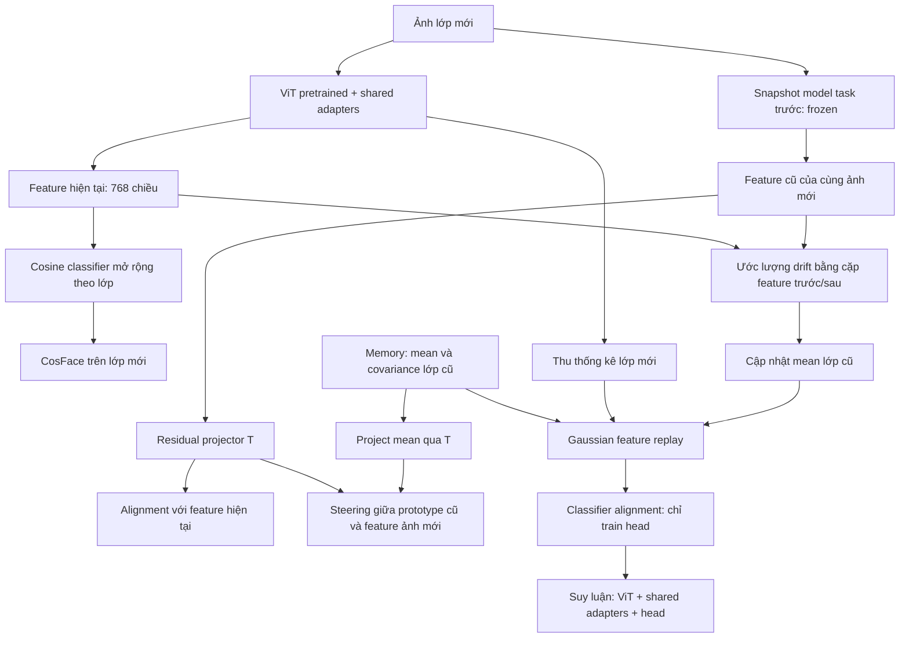
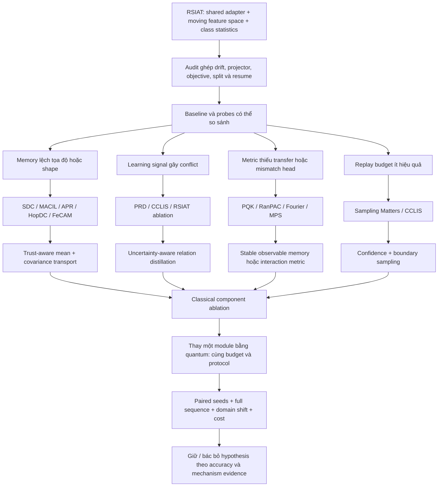

# RSIAT × QML: research map dựa trên bottleneck

Ngày rà soát: **01/10/2026**. Phạm vi: repository hiện tại, hai log được cung cấp, paper RSIAT và literature gốc. Đây là tài liệu nghiên cứu; chưa triển khai hay chạy thí nghiệm cho các kiến trúc đề xuất.

## 0. Kết luận để định hướng

**Nên nghiên cứu tính nhất quán của phân phối lớp cũ khi representation thay đổi, trước khi tiếp tục thay cosine bằng một kernel khác.** Trong repo, adapter thay đổi ở mỗi task, trong khi covariance lớp cũ giữ nguyên; phép ước lượng drift còn có vấn đề ghép cặp dữ liệu. Một metric tốt hơn không tự sửa được memory sai hệ tọa độ.

Ba nhánh có cơ sở để khảo sát tiếp là: **transport mean–covariance có kiểm soát độ tin cậy**, **distillation quan hệ prototype–sample**, và **memory phân phối trong một không gian đặc trưng ổn định**. QML có thể làm metric/gate trong các nhánh này, nhưng cần chứng minh phần cải thiện vượt qua đối chứng MLP, RBF, Fourier và tensor network có ngân sách tương đương.

Không có bằng chứng hiện tại để hứa cải thiện đáng kể trên RSIAT. Log cho thấy QKSR đang kém baseline trong những task đã hoàn tất; chưa xác định được nguyên nhân hay mức chênh lệch có ý nghĩa thống kê. Các direction bên dưới đều là **hypothesis cần thí nghiệm**, không phải kết quả đã đạt được.

**Cách đọc:** §2–3 để hiểu diagnosis; §4 để kiểm tra nguồn; §5–7 cho mechanism, gaps và tám kiến trúc; §8–9 cho thí nghiệm và shortlist. Tài liệu phân tích 24 paper trong 23 mục literature; không có kết quả tái lập mới.

## 1. Cách tìm và đánh giá literature

### 1.1 Câu hỏi và quy trình

Review này là **scoping review có quy trình theo cơ chế**, không phải systematic review thống kê bao phủ toàn bộ cơ sở dữ liệu. Không tạo số lượng paper tìm thấy/loại bỏ giả định, không tuyên bố đã chứng minh novelty toàn ngành.

Quy trình: đọc code và log → xác định bottleneck → tìm paper gốc → đọc phần phương pháp, công thức, thí nghiệm/ablation liên quan → truy ngược nguồn gốc cơ chế → kiểm tra literature phản biện và điều kiện protocol → thiết kế đối chứng trong RSIAT.

| Bottleneck/câu hỏi | Nhóm truy vấn tiêu biểu | Nguồn giữ lại |
|---|---|---|
| Memory không theo kịp representation | `semantic drift compensation covariance exemplar free continual learning` | SDC, SSIAT, MACIL, APR, HopDC |
| Classifier và phân phối lệch nhau | `classifier alignment Gaussian class incremental pretrained`, `heterogeneous covariance continual learning` | SLCA, FeCAM, RanPAC |
| Loss xóa cấu trúc quan hệ hữu ích | `prototype sample relation distillation replay free`, `importance sampling contrastive continual learning` | PRD, CCLIS |
| Quantum metric có lợi ở đâu? | `quantum embeddings metric learning`, `projected quantum kernel geometric difference` | Lloyd; Huang |
| Quantum attention/gating có bằng chứng trực tiếp? | `quantum gated knowledge distillation class incremental learning` | QKD |
| Gain có thực sự nhờ circuit? | `quantum machine learning classical benchmarks`, `classical surrogates quantum learning Fourier` | Bowles; Schreiber; Schuld |
| Circuit khó train/đo | `quantum kernel concentration`, `local cost barren plateaus identity initialization`, `quantum natural gradient` | Thanasilp; Cerezo; Grant; Stokes |
| Replay phi Gaussian / interaction tiết kiệm | `quantum circuit Born machine`, `supervised quantum inspired tensor networks` | Liu–Wang; Stoudenmire–Schwab |
| Ngân sách pair/replay | `sampling matters deep embedding learning`, `continual importance sampling relation distillation` | Wu; CCLIS |

Ưu tiên proceedings/journal, arXiv full text và repository tác giả. Không dùng blog làm bằng chứng. Danh mục ở §4 ghi rõ paper đã đọc tới phần nào và điểm nào chưa kiểm chứng; **có link code không đồng nghĩa đã tái lập code**. Bản arXiv có thể khác bản conference, đặc biệt SSIAT và các preprint 2026.

### 1.2 Thang bằng chứng

- **R — repo/log:** quan sát trực tiếp từ bản code hoặc log hiện tại.
- **P — paper:** cơ chế/kết quả tác giả báo cáo trong setting của paper.
- **D — suy luận:** hệ quả toán học hoặc suy luận từ implementation; chưa phải nguyên nhân thực nghiệm.
- **H — hypothesis:** sửa đổi đề xuất cho RSIAT, chưa chạy.

Một ablation trong dataset khác chỉ hỗ trợ tính hợp lý của cơ chế. Nó không xác nhận mức gain khi chuyển sang ViT-IN21K, shared adapter, CIFAR B0I10.

## 2. RSIAT đang làm gì?

### 2.1 Bài toán và bản đồ kiến trúc

Class-incremental learning không lưu ảnh cũ: mỗi task chỉ có dữ liệu lớp mới; suy luận trên **toàn bộ lớp đã gặp**, không có task ID. ViT-B/16 pretrained tạo prior mạnh. Một bộ adapter được dùng xuyên suốt các task; bộ này gồm adapter ở nhiều block Transformer, không phải chỉ một layer duy nhất.



Điểm intervention: **T** (transport), **OR/AL** (learning signal), **M/UM/ST** (memory), **G/CA** (replay và quyết định), hoặc một nhánh metric nhỏ trên **Z**. Luồng suy luận hiện tại không dùng quantum kernel.

### 2.2 Pipeline trong repo

| Thành phần | Vị trí | Vai trò thực tế |
|---|---|---|
| Điều phối task | `trainer.py`; `models/RSIAT_adapter.py::incremental_train` | Expand classifier, train adapter, cập nhật statistics, CA, evaluate, checkpoint |
| Encoder | `utils/inc_net.py::SimpleVitNet`; `network/vision_transformer_adapter.py` | Frozen backbone, train adapter bottleneck 64; feature 768 chiều |
| Base objective | `models/RSIAT_adapter.py::_compute_rt_loss`; `RS_Loss` | CosFace + warm-up pairwise representation steering |
| Incremental objective | `models/RSIAT_adapter.py::_inc_loss` | Alignment với projected old features + old/new steering |
| Projector | `utils/toolkit.py::AutoencoderSigmoid` | Encoder–decoder residual; output `z + decoder(encoder(z))` |
| Mean/covariance | `models/base.py::_compute_class_mean` | Giữ statistics lớp cũ, tính statistics lớp mới |
| Drift | `models/base.py::displacement` | Weighted average của feature displacement từ dữ liệu task mới |
| Classifier alignment | `models/base.py::_stage2_compact_classifier` | Lấy mẫu Gaussian theo lớp, train classifier trên tất cả lớp |
| QKSR | `utils/quantum_kernel.py`; `utils/qksr_statistics.py` | Low-dimensional projection → circuit → local RDM → RBF similarity |

Viết $f_t(x)$ là feature hiện tại, $T_t$ là residual projector, $\mu_c$ là mean lưu trước task. Incremental objective ở repo có dạng:

$$
L=L_{\mathrm{CosFace,new}}+\beta\operatorname{MSE}(f_t(x),T_t(f_{t-1}(x)))+\gamma L_{\mathrm{steer}}.
$$

Trong cấu hình QKSR `old_proj`, steering so sánh $T_t(\mu_c)$ với $T_t(f_{t-1}(x))$. Khi metric frozen, loss này tác động trực tiếp lên projector; adapter nhận ảnh hưởng qua alignment. Đây không phải loss trực tiếp trên current feature. Đổi sang `current` thay đổi đường gradient và mục tiêu, cần ablation riêng.

Memory mean có kích thước $O(Cd)$, covariance đầy đủ $O(Cd^2)$, head $O(Cd)$. Với $C=100,d=768$, riêng covariance float32 khoảng **225 MiB**; với 1.000 lớp khoảng **2,20 GiB**, chưa tính bản sao/trạng thái khác. Vì vậy “shared adapter không tăng theo task” không có nghĩa toàn bộ memory/model không tăng.

Ở base task, implementation dùng positive term trung bình `relu(1 − similarity)` và negative term `alpha × relu(similarity − margin)` trên các cặp tương ứng; loại diagonal khỏi positive pairs. Classical similarity là cosine, QKSR là PQK. Margin và hình dạng phân phối similarity quyết định số negative pairs thực sự có gradient. Paper Eq.4 viết negative term `1 + cosine`; đây là một khác biệt nữa cần ghi rõ khi tái lập công thức paper.

CA hiện lấy **256 synthetic features/lớp/epoch**, dùng mean còn nhân hệ số `0.9 + 0.1 × (task_index_of_class + 1)/(current_task + 1)`, rồi train head bằng SGD. Đây là heuristic theo tuổi lớp, không phải transport covariance. Khi kiểm tra cải tiến memory nên có control bật/tắt heuristic này; công thức chia `class_id // task_size` cũng cần xem lại nếu base/increment size không bằng nhau.

### 2.3 Paper gốc: bằng chứng đáng chú ý

RSIAT mô tả base steering, residual alignment, orthogonality và warm-up; supplementary Algorithm 1 mô tả khởi tạo projector mỗi task. Table 3 cho thấy thêm riêng orthogonality làm final accuracy ImageNet-R giảm **79,38 → 78,32**, còn alignment đạt **80,17**. Bỏ residual khiến ImageNet-A final giảm mạnh. Điều này hỗ trợ kiểm tra tương tác giữa các thành phần, không mặc định “repulsion mạnh hơn là tốt hơn”. [Paper RSIAT, §4–5](https://openaccess.thecvf.com/content/CVPR2026/papers/Zhao_Representation-Steered_Incremental_Adapter-Tuning_for_Class-Incremental_Learning_with_Pre-Trained_Models_CVPR_2026_paper.pdf).

### 2.4 Những khác biệt phải phân biệt với ý tưởng nghiên cứu

**Các mục sau là quan sát code và đối chiếu công thức, chưa có thí nghiệm đo ảnh hưởng. Không được gọi việc sửa chúng là quantum contribution.**

| Quan sát | Bằng chứng | Hệ quả cần kiểm chứng |
|---|---|---|
| Ghép cặp drift không bảo đảm cùng ảnh | `RSIAT_adapter.py:140` bỏ sample ID; `:204` dùng shuffled loader; `:263–276` extract hai lần; `base.py:509` lấy `Y2-Y1` theo hàng | Hai hàng có thể là hai ảnh khác nhau; augmentation cũng khác. Phải ghép bằng ID và cùng deterministic view trước khi đánh giá drift estimator |
| Orthogonal paper/code khác nhau | Paper Eq.9 dùng `abs(cos)`; `_inc_loss` classical dùng `similarity.sum()/numel`, không absolute | Signed cosine tối ưu về phía âm; absolute cosine hướng về 0. “Thay cosine bằng PQK” đồng thời đổi hình dạng mục tiêu |
| Projector không khởi tạo identity theo mô tả paper | `toolkit.py:96` dùng linear mặc định và final Sigmoid; `RSIAT_adapter.py:160` chỉ tạo tại task index 1 | Residual mỗi tọa độ thuộc (0,1), không biểu diễn trực tiếp mọi dịch chuyển có dấu; ngay cả zero preactivation cũng ra residual 0,5. Code giữ projector ở các task sau |
| Mean đổi nhưng covariance cũ không đổi | `base.py:442` copy covariance cũ; loop chỉ chạy lớp mới | Gaussian replay ghép mean mới với shape trong representation cũ. Có hàm `displacement_cov` nhưng không được gọi trong pipeline này |
| Validation split chưa xuyên suốt statistics | `_compute_class_mean` lấy toàn bộ `source='train'` của lớp, bỏ qua subset đã tách validation | Nếu dùng validation để tune, held-out samples vẫn đi vào statistics/CA. Cần thống nhất partition ở mọi stage |
| Resume không bảo đảm giống chạy liền | `base.py::save_checkpoint` không lưu đầy đủ Python/NumPy/CPU/CUDA RNG; worker RNG cũng cần xử lý | Cùng seed ban đầu không đủ cho so sánh paired sau resume |

Tham chiếu khởi tạo và lifecycle projector: [supplementary RSIAT, Algorithm 1](https://openaccess.thecvf.com/content/CVPR2026/supplemental/Zhao_Representation-Steered_Incremental_Adapter-Tuning_CVPR_2026_supplemental.pdf). Không suy ra paper chắc chắn đã chạy đúng phiên bản công thức chỉ từ mô tả; cần tách **published method**, **released implementation** và **local branch** trong báo cáo kết quả.

### 2.5 Hai log nói được gì?

Nguồn: `logs/adapter/cifar224/0/10/all_1993_pretrained_vit_b16_224_in21k_adapter.log` và file QKSR trong Downloads mà người dùng cung cấp.

| Task index | Baseline sau CA/eval hoàn tất (%) | QKSR (%) | QKSR − baseline (điểm %) |
|---|---:|---:|---:|
| 0 | 99,10 | 99,00 | −0,10 |
| 1 | 97,70 | 97,50 | −0,20 |
| 2 | 97,03 | 96,70 | −0,33 |
| 3 | 96,30 | 96,02 | −0,28 |
| 4 | 95,18 | 94,96 | −0,22 |

Trung bình chênh lệch năm mốc là **−0,226 điểm %**. Task 5 QKSR mới có pre-CA **94,13**, baseline pre-CA **94,32**; không trộn với post-CA. Các mốc tích lũy không phải năm phép thử độc lập.

QKSR có resume ở các đoạn sau; môi trường/hardware/evaluation cadence chưa được ghép hoàn toàn. Không có phân phối nhiều seed để kết luận thống kê. Kernel stats được ghi từ minibatch cuối; với 5.000 ảnh và batch 64, batch cuối chỉ 8 ảnh. Vì vậy kernel mean lớn, `grad={}` khi freeze, hoặc total loss cao hơn **không tự chứng minh** kernel collapse, barren plateau hay regularization lấn át classification. Muốn kết luận phải đo trên probe set cố định và gradient từng loss.

## 3. Bottleneck và vị trí QML có ý nghĩa

### 3.1 Những hypothesis xuất phát từ repo

| ID | Hạn chế/giả định | Tín hiệu cần đo | Điểm can thiệp |
|---|---|---|---|
| B1 | Drift học từ lớp mới có thể không ngoại suy được tới lớp cũ | Sai số transport trên pseudo-old validation; support/neighbor distance | `displacement`, projector |
| B2 | Covariance không đi cùng mean; Gaussian đơn có thể sai | Residual covariance; calibrated likelihood; pre/post-CA accuracy | Memory, CA |
| B3 | All-pair repulsion bỏ qua cấu trúc semantic và độ tin cậy prototype | Old–new confusion, gradient conflict, relation preservation | `_inc_loss` |
| B4 | Metric học ở 10 lớp đầu có thể không transfer | Kernel–label alignment và rank trên lớp mới held-out | Quantum projection/circuit/freeze policy |
| B5 | Geometry của loss khác geometry của head | Gain nearest-prototype theo metric nhưng không gain cosine head | Readout, CA, metric distillation |
| B6 | Nhiều pair/replay sample dễ, ít tín hiệu ở boundary | Gradient variance, lỗi theo margin và covariance uncertainty | Pair sampling và Gaussian replay |
| B7 | Metric module có thể chỉ là một nonlinear bottleneck đắt tiền | Equal-budget classical controls, no-CNOT, Fourier surrogate | QuantumKernelModule |

B1–B7 là hướng đo, không phải kết luận nguyên nhân accuracy thấp.

### 3.2 QKSR hiện tại là gì về mặt toán học?

$$
z\in\mathbb R^{768}\to a=\pi\tanh(W\operatorname{LN}(z)+b)
\to |\psi_\theta(a)\rangle\to r_\theta(z)
\to k(z,z')=\exp[-\eta\|r_\theta(z)-r_\theta(z')\|^2].
$$

`r` gồm vector hóa reduced density matrices (RDM). Circuit dùng real $R_y$/CNOT trong PyTorch statevector. Cấu hình q=8, L=2 có 6.152 tham số projection, 16 góc circuit và 1 bandwidth: **6.169 tham số**. Kernel order 1 chỉ quan sát local marginals; với real state, mỗi one-qubit RDM có tối đa hai tọa độ Bloch độc lập, không phải cung cấp tự do $2^8$ đặc trưng cho head.

Đây là **projected quantum kernel mô phỏng classical**, không phải full-state fidelity, không dùng quantum hardware. Với statevector, riêng state storage tăng $O(B2^q)$, gate evaluation xấp xỉ $O(BLq2^q)$, chưa tính RDM/autograd. Giữ q nhỏ có thể chạy được; không suy ra speedup quantum.

**Hai đối chứng toán học cần có (suy luận của review):**

1. Nếu dùng full fidelity với cùng unitary độc lập dữ liệu ở cuối, $\langle U_\theta\phi(x)|U_\theta\phi(y)\rangle=\langle\phi(x)|\phi(y)\rangle$. Khi đó học unitary ấy không đổi kernel. Local projection hoặc data interleaving có thể phá điều kiện triệt tiêu; phải kiểm tra ansatz cụ thể.
2. Với `pqk_no_cnot`, chỉ $R_y$ và không reupload, các góc cùng qubit cộng lại. Khoảng cách Frobenius one-qubit giữa hai input bất biến dưới cùng rotation thêm vào; circuit angles không thêm tự do cho kernel distance. Projection vẫn học được. Đối chứng sin/cos trực tiếp giúp xác định lợi ích do circuit interaction hay do classical projection/bandwidth.

### 3.3 Thành phần nên giữ classical

- ViT image/token backbone: dữ liệu 224×224 và feature giàu thông tin; quantum hóa toàn bộ tạo bottleneck encoding, độ sâu và measurement rất lớn.
- Gaussian statistics, covariance shrinkage, linear classifier: có lời giải classical hiệu quả; chưa có bottleneck đủ căn cứ để dùng quantum linear solver hoặc qRAM.
- Toàn bộ optimizer ViT: QNG chỉ hợp lý để thử trên circuit nhỏ đang train; không thay SGD của hàng triệu trọng số bằng quantum optimization một cách mặc định.
- Quantum reinforcement learning: pipeline hiện tại không có môi trường/action/reward tương ứng; thêm RL sẽ tạo một bài toán khác.
- Generative quantum image replay: không có cơ sở từ generator few-qubit để sinh ảnh 224×224. Nếu khảo sát, bắt đầu từ residual latent nhỏ (§6, Idea 6).
- Adapter-per-task quantum routing: làm thay đổi ràng buộc shared adapter; chỉ được xem như track kiến trúc riêng với budget riêng.

## 4. Literature landscape: trích xuất cơ chế và giới hạn

Mỗi mục dưới đây ghi thông tin nguồn, phần đã đọc, mechanism, evidence, giả định/cost và khả năng transfer. Các mục 4.1–4.10 và 4.22–4.23 là classical, không cần simulator/NISQ. Mục 4.20 là tensor network chạy classical. Các paper QML được phân biệt cụ thể về mức bằng chứng phần cứng. “Chưa xác minh code” không khẳng định tác giả không công bố code.

### 4.1 RSIAT — nền tảng và tương tác objective

**Jiarui Zhao, Libo Huang, Xiangqi Li, Zhulin An, Chuanguang Yang, Yu Wang, Boyu Diao, Yongjun Xu. 2026. _Representation-Steered Incremental Adapter-Tuning for Class-Incremental Learning with Pre-Trained Models_. CVPR, 18010–18020.** [Proceedings](https://openaccess.thecvf.com/content/CVPR2026/html/Zhao_Representation-Steered_Incremental_Adapter-Tuning_for_Class-Incremental_Learning_with_Pre-Trained_Models_CVPR_2026_paper.html); [code](https://github.com/zjrzjrz/RSIAT). DOI/arXiv chưa xác minh.

Đã đọc §3–5 và supplementary Algorithm 1. Cơ chế và evidence chính ở §2 của tài liệu này. Transfer quan trọng: residual identity prior và warm-up; không thể suy từ tên “orthogonal” rằng mọi repulsion kernel tương đương. Chi phí huấn luyện gồm teacher snapshot/projector, memory và CA; inference bỏ projector. Local code phải được đối chiếu riêng với công thức.

### 4.2 SSIAT — drift compensation trong shared adapter

**Yuwen Tan, Qinhao Zhou, Xiang Xiang, Ke Wang, Yuchuan Wu, Yongbin Li. 2024. _Semantically-Shifted Incremental Adapter-Tuning is A Continual ViTransformer_. CVPR.** [arXiv:2403.19979](https://arxiv.org/abs/2403.19979); [code](https://github.com/HAIV-Lab/SSIAT). Bản arXiv cập nhật mang tên _Continual Adapter Tuning with Semantic Shift Compensation for Class-Incremental Learning_.

Đọc phương pháp drift và classifier refinement. Shared adapter, hiệu chỉnh prototype từ chuyển dịch trên ảnh mới, rồi synthetic-feature calibration là tiền đề trực tiếp của repo. Giả định: drift có thể chuyển giao theo lân cận feature. Cost statistics/replay tăng theo lớp. Transfer vào `displacement`/CA; không coi local interpolation là bảo đảm tại lớp cũ không có support. Gain của toàn pipeline không tách được thành lợi ích của metric retrieval riêng. [Full text](https://arxiv.org/pdf/2403.19979).

### 4.3 SDC — nội suy displacement

**Lu Yu, Bartlomiej Twardowski, Xialei Liu, Luis Herranz, Kai Wang, Yongmei Cheng, Shangling Jui, Joost van de Weijer. 2020. _Semantic Drift Compensation for Class-Incremental Learning_. CVPR.** [arXiv:2004.00440](https://arxiv.org/abs/2004.00440); DOI **10.1109/CVPR42600.2020.00701**; code chưa xác minh.

Đọc phần estimator và experiments. Dùng cặp embedding trước/sau, trọng số khoảng cách, bù drift prototype không cần ảnh cũ. Improvement đến từ memory alignment; giả định drift smooth/local. Pairwise weights tốn $O(CNd)$ nếu làm dense. Thay kernel weighting trong `displacement` là transfer hợp lý; không khắc phục việc không có anchor gần prototype. Ghép sai sample phá tiền đề estimator. [Full text](https://arxiv.org/pdf/2004.00440).

### 4.4 SLCA — representation và classifier là hai nguồn lỗi

**Gengwei Zhang, Liyuan Wang, Guoliang Kang, Ling Chen, Yunchao Wei. 2023. _SLCA: Slow Learner with Classifier Alignment for Continual Learning on a Pre-trained Model_. ICCV.** [arXiv:2303.05118](https://arxiv.org/abs/2303.05118); [code](https://github.com/GengDavid/SLCA).

Đọc slow learner, Gaussian CA, ablation. LR nhỏ ở representation cùng retraining head từ moments giúp hạn chế progressive overfitting và classifier bias. Không thể quy toàn bộ gain cho Gaussian replay. Cần representation tương đối ổn định, moments đại diện tốt; covariance/replay tốn bộ nhớ/thời gian. Transfer vào LR schedule, `_compute_class_mean`, `_stage2_compact_classifier`; không bê nguyên hyperparameter của fine-tuning sang adapter. [Full text](https://arxiv.org/pdf/2303.05118).

### 4.5 FeCAM — anisotropy có ích nếu covariance được xử lý đúng

**Dipam Goswami, Yuyang Liu, Bartłomiej Twardowski, Joost van de Weijer. 2023. _FeCAM: Exploiting the Heterogeneity of Class Distributions in Exemplar-Free Continual Learning_. NeurIPS.** [arXiv:2309.14062v3](https://arxiv.org/html/2309.14062v3); [code](https://github.com/dipamgoswami/FeCAM).

Đọc §3, preprocessing ablation và supplementary. Mahalanobis theo lớp, shrinkage/normalization xử lý covariance khác nhau. Ablation cho thấy dùng covariance thô có thể kém xa Euclidean; lợi ích phụ thuộc preprocessing. Frozen feature là giả định quan trọng; lưu đầy đủ tốn $O(Cd^2)$. Transfer vào head hoặc CA diagnostics sau transport; không đưa covariance cũ vào feature đang đổi rồi kỳ vọng tương đương FeCAM. Tukey transform cho feature không âm không được áp máy móc lên signed ViT feature.

### 4.6 RanPAC — nonlinear features và sufficient statistics ổn định

**Mark D. McDonnell, Dong Gong, Amin Parvaneh, Ehsan Abbasnejad, Anton van den Hengel. 2023. _RanPAC: Random Projections and Pre-trained Models for Continual Learning_. NeurIPS.** [arXiv:2307.02251](https://arxiv.org/abs/2307.02251); [code](https://github.com/RanPAC/RanPAC).

Đọc algorithm, random-feature ablation và width sweep. PETL đầu chuỗi rồi freeze, nonlinear expansion, tích lũy Gram/class sums, ridge readout. Gain gồm decorrelation và nonlinear expansion; không chỉ số parameter. Gram matrix tốn $O(M^2)$, paper dùng M=10.000 trong nhiều thí nghiệm. Transfer thành stable analytic branch hoặc classical control của quantum features. Không cộng statistics qua task nếu feature map đã đổi mà không transport/recompute. [Full text](https://arxiv.org/pdf/2307.02251).

### 4.7 PRD — bảo toàn quan hệ thay vì ép tọa độ

**Nader Asadi, MohammadReza Davari, Sudhir Mudur, Rahaf Aljundi, Eugene Belilovsky. 2023. _Prototype-Sample Relation Distillation: Towards Replay-Free Continual Learning_. ICML, PMLR 202:1093–1106.** [Proceedings](https://proceedings.mlr.press/v202/asadi23a.html); arXiv **2303.14771**; [repository được paper dẫn](https://github.com/naderAsadi/CLHive).

Đọc §3, Eq.5 và experiments. Supervised contrastive representation, learned prototypes và KL quan hệ teacher–student. Normalization quan hệ trong paper là **trên samples cho từng prototype**. Giữ cấu trúc tương đối thay vì MSE từng tọa độ là cơ chế transfer sang `_inc_loss`. Cost quan hệ $O(CB)$ sau feature extraction. Chú ý protocol task-incremental/class-incremental; không lấy gain có task ID làm bằng chứng cho setting RSIAT. [Full text](https://proceedings.mlr.press/v202/asadi23a/asadi23a.pdf).

### 4.8 MACIL — covariance compensation đã có tiền lệ

**Fangwen Wu, Lechao Cheng, Shengeng Tang, Xiaofeng Zhu, Chaowei Fang, Dingwen Zhang, Meng Wang. 2025. _Navigating Semantic Drift in Task-Agnostic Class-Incremental Learning_. ICML.** [Proceedings](https://proceedings.mlr.press/v267/wu25f.html); [arXiv:2502.07560v2](https://arxiv.org/html/2502.07560v2); [code](https://github.com/fwu11/MACIL).

Đọc mean shift, covariance compensation, patch distillation và component ablation. Dùng cấu trúc phân phối/quan hệ Mahalanobis cùng compensation; gain có tương tác với classifier alignment. Backbone adaptation dùng LoRA, không hoàn toàn trùng RSIAT. Transfer: bảo toàn geometry phân phối vào memory/alignment; cost covariance và feature distillation. Không tuyên bố “thêm covariance compensation” là novelty mới, hoặc quy gain của tổ hợp CC+CA cho CC đơn lẻ.

### 4.9 LR-RGDA/HopDC — low-rank covariance và associative drift

**Xuan Rao, Mingming Ha, Bo Zhao, Derong Liu, Cesare Alippi. 2026. _Scalable Analytic Classifiers with Associative Drift Compensation for Class-Incremental Learning of Vision Transformers_.** [arXiv:2602.00144v1](https://arxiv.org/html/2602.00144v1), preprint; [code](https://github.com/raoxuan98-hash/lr_rgda_hopdc).

Đọc §3, anchor setup và data-efficiency ablation. Shared covariance + low-rank class correction; associative interpolation truy hồi drift. Theo biểu diễn ở thân bài, storage $O(d^2+Cdr)$; tránh chép nhầm complexity khác ở abstract. Dùng **1.024 ảnh ImageNet-1K không nhãn bên ngoài**, cộng ảnh task hiện tại. Transfer retrieval/low-rank statistics; không coi setting đó ngang current-task-only RSIAT. Giả định support đủ và drift smooth là điểm cần kiểm định, nhất là khi bỏ external anchors.

### 4.10 APR — tạo pseudo support gần lớp cũ

**Hiroto Honda. 2026. _Adversarial Pseudo-replay for Exemplar-free Class-incremental Learning_. WACV, 7493–7502.** [Proceedings](https://openaccess.thecvf.com/content/WACV2026/html/Honda_Adversarial_Pseudo-replay_for_Exemplar-free_Class-incremental_Learning_WACV_2026_paper.html); [arXiv:2511.17973v1](https://arxiv.org/html/2511.17973v1); code chưa kiểm tra implementation.

Đọc §3.2–3.6 và §4.4. Perturb ảnh mới hướng prototype cũ, KD trên pseudo-images; học transfer matrix rồi cập nhật $W\Sigma W^T$. Calibration ablation báo mất accuracy khi bỏ cả mean/covariance update, chưa cô lập từng phần. Cost nhiều forward/backward attack và fitting transform. Transfer: tạo support cho transport; không đồng nhất pseudo-image với ảnh cũ thật. Đây là prior art trực tiếp của covariance transport, không phải quantum evidence.

### 4.11 Quantum embeddings — metric objective phải học cấu trúc nào?

**Seth Lloyd, Maria Schuld, Aroosa Ijaz, Josh Izaac, Nathan Killoran. 2020. _Quantum embeddings for machine learning_.** [arXiv:2001.03622](https://arxiv.org/pdf/2001.03622), venue/code riêng chưa xác minh.

Đọc objective Hilbert–Schmidt giữa class ensembles và thí nghiệm nhỏ. Metric learning cân bằng concentration trong lớp với separation giữa lớp. Điều này hỗ trợ mục tiêu distribution-level, không xác nhận repulsion tất cả prototype. Pairwise overlaps có cost sampling; simulator chạy được, hardware dùng overlap estimation lặp nhiều shots. Evidence không phải ViT-CIL hay hardware advantage. Transfer objective ở base hoặc sketches; không chuyển kết quả bài toán nhỏ thành dự đoán gain CIFAR.

### 4.12 Projected kernels — hỗ trợ inductive bias, không bảo đảm advantage

**Hsin-Yuan Huang, Michael Broughton, Masoud Mohseni, Ryan Babbush, Sergio Boixo, Hartmut Neven, Jarrod R. McClean. 2021. _Power of data in quantum machine learning_. Nature Communications 12, 2631.** [Paper](https://www.nature.com/articles/s41467-021-22539-9); DOI **10.1038/s41467-021-22539-9**; arXiv **2011.01938**; code chưa xác minh.

Đọc projected features và geometric comparison. Local measurements tạo kernel có inductive bias khác; evidence advantage liên quan dữ liệu/nhãn được thiết kế và điều kiện so sánh, không phải tự động ở ảnh tự nhiên. Statevector hoặc measurement có cost riêng. Transfer vào `QuantumKernelModule`, kèm đo alignment và classical competitor. Không coi số chiều Hilbert lớn là bằng chứng tăng thông tin hữu dụng cho classifier.

### 4.13 QKD — quantum gating trong CIL, nhưng evidence cần kiểm tra kỹ

**Linjie Li, Huiyu Xiao, Jiarui Cao, Zhenyu Wu, Yang Ji. 2026. _Quantum-Gated Task-interaction Knowledge Distillation for Pre-trained Model-based Class-Incremental Learning_.** [arXiv:2604.11112v1](https://arxiv.org/html/2604.11112v1); repository ghi CVPR 2026. [Repo hiện chỉ có README khi kiểm tra](https://github.com/Frank-lilinjie/CVPR26-QKD).

Đọc §4–5, Tables 3–4. Fidelity gate điều phối KD/routing giữa nhiều adapters. Table 4: IN-R quantum 81,79 so cosine 80,32; time 326,85 so 211,25 giây. Table 3 baseline bỏ modules chọn adapter ngẫu nhiên, nên không cô lập quantum. Chưa thấy hardware/noise evidence. Transfer gate vào loss; không chuyển nguyên pool sang shared-adapter budget.

**Kiểm tra đại số của review:** Eq.12 softmax làm $\|\alpha\|_1=1$, nên Eq.11 không tạo sparsity nếu đúng như viết. Chưa có code để giải quyết bất nhất này; không dùng claimed sparsity gain làm cơ sở kiến trúc.

### 4.14 Concentration — PQK cũng có thể mất khả năng phân biệt

**Supanut Thanasilp, Samson Wang, M. Cerezo, Zoë Holmes. 2024. _Exponential concentration in quantum kernel methods_. Nature Communications 15, 5200.** [Paper](https://www.nature.com/articles/s41467-024-49287-w); DOI **10.1038/s41467-024-49287-w**; [arXiv:2208.11060](https://arxiv.org/pdf/2208.11060); [code](https://github.com/Supanut-Thanasilp/Exponential-concentration-in-quantum-kernel-methods).

Đọc main theorems, projected-kernel analysis và numerical shot experiments. Expressivity, global measurements, entanglement và noise có thể gây concentration; phân giải kernel khi ấy cần shots tăng mạnh. Simulator exact che measurement cost. Transfer thành diagnostics theo q/depth/order/shots; không suy ra q=8 trong log đã collapse chỉ từ mean similarity. Không phải định lý phủ định mọi PQK.

### 4.15 Benchmark phản biện — phải tune classical đủ công bằng

**Joseph Bowles, Shahnawaz Ahmed, Maria Schuld. 2024. _Better than classical? The subtle art of benchmarking quantum machine learning models_.** [arXiv:2403.07059v2](https://arxiv.org/html/2403.07059v2); venue cuối chưa xác minh; [code](https://github.com/XanaduAI/qml-benchmarks).

Đọc benchmark protocol, HPO và ablation. Trên tập bài toán nhỏ khảo sát, classical models thường cạnh tranh/vượt quantum; bỏ entanglement có thể không làm tệ hơn. Cơ chế gain có thể là preprocessing/inductive bias chứ không phải quantum resource. Simulator benchmark không chứng minh hardware speedup. Transfer: controls và HPO budget, không phải một module. Không tổng quát kết quả thành “QML luôn vô ích” hay bằng chứng trực tiếp chống QKD.

### 4.16 Fourier surrogate — kiểm tra phần nào thực sự cần circuit

**Franz J. Schreiber, Jens Eisert, Johannes Jakob Meyer. 2023. _Classical Surrogates for Quantum Learning Models_. Physical Review Letters 131, 100803.** [arXiv:2206.11740](https://arxiv.org/pdf/2206.11740); DOI **10.1103/PhysRevLett.131.100803**; code chưa xác minh.

Đọc construction và numerical comparison. Quantum functions có Fourier structure; một số surrogate classical có thể học hoặc thay thế chúng. Không phải mọi circuit đều có surrogate nhỏ: số frequencies có thể tăng mạnh. Transfer: sin/cos, interaction features và surrogate matching trong metric ablation. Classical surrogate không cần hardware; original circuit có simulator/measurement cost. Nếu surrogate ngang accuracy rẻ hơn, contribution nên trình bày là inductive bias thay vì quantum necessity.

### 4.17 Data encoding — reupload tăng hàm biểu diễn, không tự tăng accuracy

**Maria Schuld, Ryan Sweke, Johannes Jakob Meyer. 2021. _Effect of data encoding on the expressive power of variational quantum-machine-learning models_. Physical Review A 103, 032430.** [arXiv:2008.08605](https://arxiv.org/pdf/2008.08605); DOI **10.1103/PhysRevA.103.032430**; [code](https://github.com/XanaduAI/expressive_power_of_quantum_models).

Đọc Fourier characterization. Encoding quyết định frequencies; repeated encoding mở rộng spectrum. Đây là evidence biểu diễn, chưa phải continual-learning generalization. Transfer vào `reupload` và Fourier controls; thêm depth/circuit evaluation, hardware chịu thêm noise. Không chữa memory drift chỉ bằng tăng spectrum. Các ví dụ simulator không xác nhận lợi ích NISQ trên pipeline RSIAT.

### 4.18 Initialization và local costs — biện pháp có điều kiện

**Edward Grant, Leonard Wossnig, Mateusz Ostaszewski, Marcello Benedetti. 2019. _An initialization strategy for addressing barren plateaus in parametrized quantum circuits_. Quantum 3, 214.** [Paper](https://quantum-journal.org/papers/q-2019-12-09-214/); DOI **10.22331/q-2019-12-09-214**; [arXiv:1903.05076](https://arxiv.org/pdf/1903.05076); code riêng chưa xác minh.

Đọc identity-block construction và gradient experiments. Paired inverse blocks kiểm soát effective depth lúc khởi tạo. Transfer khi train circuit sâu hơn; không bảo đảm suốt training. `theta≈0` với CNOT còn nguyên không tương đương identity-block initialization. Simulator được; hardware cần thực thi gate/noise budget.

**M. Cerezo, Akira Sone, Tyler Volkoff, Lukasz Cincio, Patrick J. Coles. 2021. _Cost function dependent barren plateaus in shallow parametrized quantum circuits_. Nature Communications 12, 1791.** [Paper](https://www.nature.com/articles/s41467-021-21728-w); DOI **10.1038/s41467-021-21728-w**; arXiv **2001.00550**; code chưa xác minh.

Đọc local/global cost theorem. Local observables và shallow ansatz có gradient scaling thuận lợi dưới giả định cụ thể. Không suy thẳng sang composite PQK loss sau nonlinear classical projection. Transfer thành lựa chọn readout và kiểm tra gradient; simulator/hardware đều cần phân biệt noise và landscape.

### 4.19 QNG — thử khi đã xác định bottleneck optimization

**James Stokes, Josh Izaac, Nathan Killoran, Giuseppe Carleo. 2020. _Quantum Natural Gradient_. Quantum 4, 269.** [Paper](https://quantum-journal.org/papers/q-2020-05-25-269/); DOI **10.22331/q-2020-05-25-269**; [arXiv:1909.02108](https://arxiv.org/pdf/1909.02108); implementation PennyLane được paper dẫn.

Đọc §2–3 và cost appendix. Precondition gradient bằng quantum geometric tensor, dùng diagonal/block approximation. Numerical circuits hội tụ tốt hơn một số optimizer; không phải classification gain trên RSIAT. Có overhead tính metric/solve, và shots; diagonal giảm chi phí. Transfer chỉ circuit parameters đang train, so Adam/SGD cùng wall time. Với incremental circuit frozen, QNG không giải quyết gì. Pure-state geometry không tự xử lý hardware noise.

### 4.20 Tensor network — tương tác bậc cao với rank kiểm soát được

**E. Miles Stoudenmire, David J. Schwab. 2016. _Supervised Learning with Quantum-Inspired Tensor Networks_. NeurIPS.** [arXiv:1605.05775](https://arxiv.org/pdf/1605.05775); [code](https://github.com/emstoudenmire/TNML).

Đọc product feature map, MPS optimization và MNIST experiments. Bond dimension giới hạn tensor interactions, vừa biểu diễn vừa regularize. Chạy classical, không cần simulator/shots/NISQ. Transfer vào compact interaction metric hoặc residual gate; cost tăng theo bond dimension, phụ thuộc contraction/training algorithm. Evidence trên static image classification không chứng minh CL. Không gọi tensor-network accuracy là hardware quantum advantage.

### 4.21 Born machine — chỉ có cơ sở cho latent replay nhỏ

**Jin-Guo Liu, Lei Wang. 2018. _Differentiable Learning of Quantum Circuit Born Machine_. Physical Review A 98, 062324.** [arXiv:1804.04168](https://arxiv.org/pdf/1804.04168); DOI **10.1103/PhysRevA.98.062324**; [code](https://github.com/GiggleLiu/QuantumCircuitBornMachine).

Đọc MMD training, gradient và Bars-and-Stripes/Gaussian-mixture experiments. Circuit sinh bitstring theo Born probabilities; evidence là phân phối nhỏ, simulator. Có thể lấy mẫu trên NISQ về nguyên tắc, nhưng noisy gradients/measurement tốn chi phí. Transfer sang conditional low-dimensional residual latent là hypothesis mới; không có phép nối sẵn từ q-bit distribution tới feature ViT 768 chiều. Generator cũng có thể quên lớp cũ.

### 4.22 Sampling Matters — chọn pair ảnh hưởng mạnh đến gradient

**Chao-Yuan Wu, R. Manmatha, Alexander J. Smola, Philipp Krähenbühl. 2017. _Sampling Matters in Deep Embedding Learning_. ICCV.** [arXiv:1706.07567](https://arxiv.org/pdf/1706.07567); DOI **10.1109/ICCV.2017.309**; code chưa xác minh.

Đọc distance distribution, weighted sampling và experiments. Distance-weighted sampling tránh đa số negatives quá dễ và instability của hardest-only. Evidence thuộc metric learning, không phải old prototype có sai số. Transfer vào pair/replay selection với uncertainty gate; pair scoring vẫn có chi phí nếu enumerate toàn bộ. Đối chứng cần uniform, semi-hard và cùng số samples.

### 4.23 CCLIS — importance sampling và relation distillation đã được kết hợp

**Jiyong Li, Dilshod Azizov, Yang Li, Shangsong Liang. 2024. _Contrastive Continual Learning with Importance Sampling and Prototype-Instance Relation Distillation_. AAAI 38(12), 13554–13562.** [Proceedings](https://ojs.aaai.org/index.php/AAAI/article/view/29259); DOI **10.1609/aaai.v38i12.29259**; [arXiv:2403.04599](https://arxiv.org/html/2403.04599v1); [code](https://github.com/lijy373/CCLIS).

Đọc sampling estimator, buffer selection và RQ2 ablation. Importance correction giảm bias do chọn memory theo độ khó; relation KD bổ sung retention. Paper **lưu exemplars**: không chuyển nguyên replay buffer sang RSIAT. Transfer nguyên lý variance/bias sang synthetic-feature sampling; không coi “hard sampling + PRD” là novelty tự thân. Gain trên setting có buffer không xác nhận chất lượng pseudo samples.

## 5. Mechanism table và research gaps

### 5.1 Mapping trực tiếp vào RSIAT

Ký hiệu: $N$ ảnh hiện tại, $B$ minibatch, $C$ lớp, $d=768$, $m$ chiều observable/latent, $r$ covariance rank, $q$ qubit, $L$ circuit depth. Complexity dưới đây là phần thêm hoặc thay thế, chưa gồm ViT; phải đo wall time thực tế.

| Paper mechanism | Thành phần RSIAT | Thay/thêm ở đâu | Expected effect — hypothesis | Cost/complexity | Rủi ro |
|---|---|---|---|---|---|
| SDC/SSIAT local interpolation | `displacement` | Paired feature support; learn affinity, support confidence | Giảm sai mean cũ | Dense weights $O(CNd)$; shortlist có thể giảm | Current data xa lớp cũ |
| MACIL/APR covariance correction | `_class_covs`, CA | Cập nhật shape cùng mean | Synthetic features phù hợp representation mới | Full matrices đắt; low-rank $O(Cdr)$ storage | Transport ngoại suy sai; không còn PSD nếu cập nhật tùy tiện |
| HopDC associative retrieval | Gaussian distance weights cố định | Retrieval trên cặp feature trước/sau | Chọn drift anchors có ích | $O(CNm)$ scoring sau encoding | External anchors trong paper không thuộc strict setting |
| FeCAM shrinkage/anisotropy | Cosine/CA head | Calibrated covariance head hoặc control | Boundary phù hợp phân phối từng lớp | Full inverse/factorization đắt | Covariance stale; covariance nhiễu |
| PRD relation KL | All-pair steering | Teacher/student relation matrix | Giữ cấu trúc và plasticity | $O(CBm)$ similarity | Teacher sai, batch relation nhiễu |
| Quantum embeddings/PQK | Kernel của steering | Distribution sketches / kernel retrieval | Local nonlinear geometry hữu ích | Statevector $2^q$, pair distances | Projection mất thông tin; concentration |
| QKD relevance gate | Hệ số alignment/steering cố định | Training-only gate của từng sample/prototype | Giảm constraint sai hoặc quá mạnh | Circuit trên low-dimensional descriptors | Gate tự giảm loss bằng cách tắt constraint |
| RanPAC stable sufficient statistics | Trainable representation + CA | Frozen branch, ridge head | Memory có hệ tọa độ ổn định | $O(M^2+MC)$ statistics | Không thích nghi domain; thêm branch inference |
| Born machine implicit distribution | Gaussian sampler | Conditional residual latent sampler | Khôi phục multimodality | Generator fitting + decoder + samples | Thông tin đã mất không thể tái tạo từ mean/cov |
| Tensor-network product features | PQK metric/gate | MPS interaction layer | Kiểm soát interaction bằng bond rank | Với scalar output, dạng đơn giản $O(ms\chi^2)$ | Feature ordering; rank quá nhỏ/lớn |
| Sampling Matters/CCLIS | Uniform pair/replay | Proposal có confidence, importance correction | Nhiều gradient hữu ích cùng budget | Candidate pool + scoring | Amplify pseudo-label/statistics error |
| Grant/Cerezo/QNG | Circuit training | Initialization, local readout, preconditioning | Cải thiện gradient nếu đúng bottleneck | Extra evaluations, metric matrix/solve | Circuit frozen hoặc objective sai thì không giúp |

### 5.2 Research gaps có thể phát biểu trung thực

1. **Transport có biết khi nào không đáng tin?** Local drift và covariance compensation đã tồn tại. Gap đáng khảo sát trong RSIAT là calibration của độ tin cậy khi support chỉ đến từ lớp mới, và quan hệ giữa metric similarity với **transport error**, không chỉ class similarity.
2. **Giữ relation trong khi memory thay đổi hệ tọa độ.** PRD và CCLIS đã có relation distillation. Câu hỏi còn lại cho nhánh này là quan hệ nào phải giữ, quan hệ nào được thay đổi, khi mean/covariance lớp cũ chỉ là estimates và adapter dùng chung.
3. **Memory có thống kê của nonlinear features, thay vì nonlinear transform của mean.** Không được đánh đồng $E[r(z)]$ với $r(E[z])$. Có thể nghiên cứu budget/sketch sufficient cho quyết định và kiểm soát coordinate drift qua task.
4. **Quantum resource attribution trong một module nhỏ của CIL.** Gain còn tồn tại sau equal-width/equal-parameter/Fourier/no-entanglement controls và cùng HPO budget hay không? Đây là câu hỏi thực nghiệm rõ hơn “quantum có tốt hơn RSIAT không?”.
5. **Phân bổ computation theo uncertainty của memory.** Sampling đã có prior art. Gap hẹp là phân bổ finite replay/measurement budget theo joint uncertainty của boundary và transport trong setting không có exemplars.

Các gap trên là **ứng viên sau tập literature đã đọc**, chưa phải chứng nhận chưa có paper khác làm. Trước khi đặt tên/phát biểu contribution cần tìm tiếp từng claim cụ thể, đặc biệt các nhánh distribution transport, kernel mean embeddings, uncertainty-aware distillation và adaptive replay.

## 6. Tám hướng nghiên cứu

Các kiến trúc trong phần này là đề xuất của review. Mỗi hướng có phiên bản classical đầy đủ; quantum module là biến thí nghiệm thay thế được. Không ghép tất cả trong run đầu.

### Idea 1 — Transport phân phối với độ tin cậy của support

**Motivation.** Memory lớp cũ cần mean và covariance trong cùng representation; current-task support có thể không bao phủ lớp cũ. Hiện repo chỉ dịch mean, với estimator ghép hàng chưa bảo đảm.

**Literature evidence.** SDC/SSIAT hỗ trợ nội suy drift; MACIL/APR chứng minh covariance compensation là prior art; HopDC gợi retrieval và low-rank representation nhưng dùng auxiliary data; FeCAM cho thấy phải regularize covariance. Evidence cho **quantum affinity tốt hơn affinity classical ở transport** chưa có.

**Core hypothesis.** Affinity dự đoán khả năng chuyển giao displacement, kết hợp calibrated trust, sẽ giảm memory error tốt hơn affinity chỉ tối ưu phân loại.

**Proposed architecture.**

```text
cùng ảnh, cùng deterministic view
       ├─ frozen old encoder ─ z_old ─┐
       └─ current encoder ─── z_new ─┴─ paired displacement database (trong task)
old distribution ─ retrieval metric ─ local signed transport + confidence
                 └─ cập nhật mean và covariance ─ Gaussian CA
```

Một mô hình khởi đầu là $T_c(z)=A_cz+b_c$, với $A_c=I+U_cV_c^T$ rank nhỏ. Ước lượng $\tilde\mu_c=A_c\mu_c+b_c$, $\tilde\Sigma_c=A_c\Sigma_c A_c^T+Q_c$, $Q_c\succeq0$. Shrinkage và trust gate phải giữ PSD. Nếu blend phân phối cũ/mới, covariance cần cả between-mean term; không chỉ trung bình hai covariance. Low-support gate giảm độ mạnh update, nhưng giữ nguyên memory cũng có bias: phải đo cả hai.

**Where it modifies RSIAT.** `extract_features`, `displacement`, cập nhật `_class_means/_class_covs`, và statistics đưa vào CA. Projector signed là đối chứng riêng; không nhất thiết thay training projector và post-task estimator đồng thời.

**Expected benefit.** Giảm old-class confusion và tăng post-CA retention, đặc biệt khi feature shape thay đổi rõ.

**Potential failure mode.** Không có support gần lớp cũ; learned confidence tự tin sai; local linearity thất bại; covariance correction khuếch đại noise.

**Computational cost.** Thêm fitting rank-r và retrieval; giữ full covariance vẫn có cost $Cd^2$. Quantum version encode N support points một lần mỗi task, cache observables rồi tính weights classical; không cần chạy circuit cho từng cặp. Simulator khả thi với q nhỏ, không cần hardware. Depth/shots lớn có thể làm affinity kém ổn định.

**Experimental validation.** Paired mean-only → mean+shared linear covariance → low-rank → trust → thay affinity RBF/MLP/Fourier/PQK. Đo transport error trên pseudo-old validation classes được tạo từ training partition; inference test chỉ chấm sau khi đóng băng lựa chọn. Tách gain do covariance, gate và metric.

**Novelty.** Nằm ở bài toán metric/trust học để dự đoán **transferability của distribution transport**, nếu kiểm chứng được. “Quantum + covariance update” tự nó chưa đủ mới.

**Supporting papers.** [SDC](https://arxiv.org/abs/2004.00440): estimator; [APR](https://arxiv.org/abs/2511.17973): covariance transport; [HopDC](https://arxiv.org/abs/2602.00144): retrieval và điều kiện support; [Huang](https://www.nature.com/articles/s41467-021-22539-9): candidate feature map, không phải bằng chứng cho transport.

### Idea 2 — Distillation quan hệ có xét sai số prototype

**Motivation.** All-pair mean repulsion không biết prototype nào sai, gần semantic hay thật sự gây confusion; `old_proj` không đưa steering gradient trực tiếp vào adapter.

**Literature evidence.** PRD hỗ trợ bảo toàn quan hệ; CCLIS cho thấy quan hệ và sampling có thể kết hợp. Chưa có evidence trực tiếp rằng PQK relation KD cải thiện shared-adapter RSIAT.

**Core hypothesis.** Bảo toàn cấu trúc quan hệ đáng tin, đồng thời để classifier học lớp mới, tạo learning signal hữu ích hơn việc đẩy mọi new feature khỏi mọi old mean.

**Proposed architecture.** Dùng frozen teacher metric $k^-$: $a^-_{ci}=\operatorname{softmax}_i(k^-(\mu_c^-,f^-(x_i))/\tau)$. Student dùng $T(\mu_c^-)$ và **current feature** $f_t(x_i)$, tạo $a^+$. Loss là $\sum_c w_c\mathrm{KL}(\operatorname{stopgrad}(a^-_c)\|a^+_c)$. Đây là sample-normalized relation; nếu đổi sang class-normalized phải gọi là biến thể và kiểm tra riêng. Có thể giữ alignment nhẹ và new-class CosFace.

**Where it modifies RSIAT.** `_inc_loss`, frozen metric snapshot, prototype confidence. Không đổi CA trong ablation đầu.

**Expected benefit.** Retention tốt hơn khi old/new classes chia sẻ feature semantic; adapter nhận gradient relational trực tiếp.

**Potential failure mode.** Teacher relations trên ảnh hoàn toàn mới không có ý nghĩa; batch nhỏ làm target nhiễu; prototype drift làm target sai; circuit đổi cùng student làm loss dễ nhưng không giữ knowledge.

**Computational cost.** Teacher encoder đã có trong RSIAT; thêm relation matrices $C\times B$ và metric representations. PQK tăng statevector/autograd; có thể cache old prototype representation, nhưng student prototype cache phải làm mới nếu T đổi. Không có inference overhead nếu chỉ dùng loss.

**Experimental validation.** Signed mean cosine/absolute cosine/margin/PRD-classical; current vs old_proj; teacher frozen vs metric cùng train; có/không uncertainty weights. Sau khi classical relation KD có ích mới thay RBF/MLP/Fourier/PQK với cùng dimension và temperature search. Đo gradient từng loss lên adapter và T, relation KL, old/new accuracy.

**Novelty.** PRD và prototype-instance KD đã tồn tại. Claim khả dĩ là uncertainty-aware relation preservation trong **moving memory coordinates**, có attribution quantum rõ; chưa xác minh novelty toàn ngành.

**Supporting papers.** [PRD](https://proceedings.mlr.press/v202/asadi23a.html): relation target; [CCLIS](https://ojs.aaai.org/index.php/AAAI/article/view/29259): prior art tổ hợp; [Schreiber](https://arxiv.org/abs/2206.11740): surrogate control.

### Idea 3 — Memory thống kê trong không gian observable ổn định

**Motivation.** Prototype hiện tại đưa $\mu_c$ qua nonlinear metric, trong khi phân phối của lớp có thể đa dạng; $r(\mu_c)$ không chứa đầy đủ thông tin của class feature distribution.

**Literature evidence.** Quantum embeddings gợi class-ensemble comparison; PQK cung cấp observable features; FeCAM gợi quyết định anisotropic; RanPAC chỉ ra lợi ích của statistics có hệ tọa độ ổn định.

**Core hypothesis.** Lưu $m_c=E[r(z)|c]$ và covariance/sketch của $r(z)$ khi lớp còn được quan sát giúp suy luận old/new tốt hơn một transformed mean, dưới cùng tổng memory budget.

**Proposed architecture.** `classical stable features → fixed small quantum/Fourier map → per-class observable moments → shrinkage distance head hoặc residual score`. Dùng stable frozen encoder branch, hoặc transport có kiểm chứng cho cả encoder và map. **Chỉ freeze circuit là chưa đủ** nếu đầu vào từ adapter đang đổi. Learned projection chỉ train trước khi commit statistics, hoặc phải có coordinate-version alignment.

**Where it modifies RSIAT.** `_compute_class_mean` thêm observable statistics; head/CA thêm score hoặc diagnostic readout. Nếu dùng branch frozen riêng, báo rõ khác baseline ở inference.

**Expected benefit.** Giảm mismatch giữa metric training và classifier, khai thác class shape với memory nhỏ.

**Potential failure mode.** One-body marginals làm hai lớp khác nhau trông giống nhau; map học ở base ít lớp thiếu transfer; covariance rank-deficient; nonlinear map của Gaussian samples chỉ phản ánh giả định Gaussian, không khôi phục distribution thật.

**Computational cost.** Observable moments $O(Cm^2)$ hoặc $O(Cmr)$, cộng cost encoding mỗi sample/inference; nếu giữ cả memory cũ thì không được tuyên bố giảm memory. Two-body order tăng observables/measurement settings. Chạy simulator trước, shots/noise kiểm tra sau.

**Experimental validation.** $r(E[z])$ vs $E[r(z)]$; mean-only vs covariance; order1/order2; stable encoder vs moving+transport; same-memory classical random/Fourier/MLP sketches. Đo calibration, accuracy và bytes thực, không chỉ số qubit.

**Novelty.** Ứng viên là thiết kế memory đủ nhỏ và nhất quán qua task cho quantum observables; “lưu quantum prototypes” là mô tả quá rộng để claim mới.

**Supporting papers.** [Quantum embeddings](https://arxiv.org/abs/2001.03622): distribution-level metric; [Huang](https://www.nature.com/articles/s41467-021-22539-9): observable map; [FeCAM](https://arxiv.org/abs/2309.14062): anisotropy; [RanPAC](https://arxiv.org/abs/2307.02251): fixed-coordinate statistics.

### Idea 4 — Hai nhánh ổn định và thích nghi, với analytic readout

**Motivation.** Một representation phải vừa giữ thông tin cũ vừa đổi theo lớp mới. Quantum metric frozen trên moving feature không tạo được một memory anchor thật sự ổn định.

**Literature evidence.** RanPAC cung cấp stable random features/readout; RSIAT cung cấp adaptive branch. Classical nonlinear features là đối chứng trực tiếp cho quantum features.

**Core hypothesis.** Stable branch bảo toàn decision evidence cũ, adaptive branch học phần domain shift; fusion có calibration sẽ tốt hơn buộc một feature space đáp ứng cả hai.

**Proposed architecture.**

```text
x ─ frozen backbone / frozen base adapter ─ fixed feature map ─ ridge scores ─┐
  └ shared adaptive RSIAT adapter ───────── cosine/CA scores ────────────────┴─ calibrated fusion
```

Statistics ridge $G=\sum hh^T, S=\sum hy^T$ chỉ tích lũy trong nhánh ổn định. Quantum map là một option cho $h$, cùng RFF/Fourier/MLP frozen. Phiên bản training-only có thể distill nhánh ổn định vào một student, nhưng đó là thí nghiệm khác; không bảo đảm giữ hết lợi ích.

**Where it modifies RSIAT.** `SimpleVitNet`/forward inference, memory của head, score calibration. Không thêm adapter mới mỗi task.

**Expected benefit.** Có thể hữu ích khi forgetting lớn nhưng PTM frozen vẫn phân biệt tốt old classes.

**Potential failure mode.** Frozen branch yếu trên domain mới, hai scores lệch scale; fusion chỉ là ensemble gain; quantum low-dimensional map kém random features rộng.

**Computational cost.** Hai feature paths thường cần thêm ViT pass: không gọi “zero overhead” vì chia sẻ trọng số không loại bỏ phép tính khi activations khác. Ridge cần $O(M^2+MC)$ memory, solve dense thường cubic theo M. Quantum map q nhỏ khả thi nhưng không có lợi thế cost mặc định.

**Experimental validation.** Single branch; dual classical linear; random/ReLU; Fourier; quantum. Match inference FLOPs và memory hoặc trình bày Pareto accuracy–latency. So fusion với training-only distillation nếu deployment yêu cầu một pass.

**Novelty.** Stable/adaptive ensembles đã là một họ phương pháp. Contribution phải nằm ở budget và cách memory/readout hợp nhất được kiểm chứng, không ở việc ghép hai branches.

**Supporting papers.** [RanPAC](https://arxiv.org/abs/2307.02251): sufficient statistics; [Bowles](https://arxiv.org/abs/2403.07059): budget controls; [Schreiber](https://arxiv.org/abs/2206.11740): classical feature-function alternative.

### Idea 5 — Gate điều chỉnh plasticity theo độ tin cậy của memory

**Motivation.** Hệ số alignment/steering cố định không phản ánh vùng feature nào memory đáng tin hoặc current task cần thay đổi nhiều.

**Literature evidence.** QKD gợi learned relevance nhưng không phù hợp nguyên trạng với shared adapter; RSIAT ablation cho thấy constraint có thể cản plasticity. Evidence cho gate ở setting này mới là gián tiếp.

**Core hypothesis.** Gate dựa trên drift magnitude, support distance, predictive margin và uncertainty sẽ chọn cường độ constraint tốt hơn một scalar chung.

**Proposed architecture.** `classical descriptors 4–8D → small VQC/MLP → bounded gate w → alignment/relation loss`. Gate dùng descriptor có stop-gradient; được calibrate trên pseudo-task validation thuộc training data, không chỉ tối ưu tổng weighted loss của chính nó. Có lower bound/budget constraint để tránh $w\to0$. Không dùng L1 của vector softmax để tạo sparsity.

**Where it modifies RSIAT.** `_inc_loss`, loss weighting schedule và diagnostic probe. Gate chỉ hoạt động khi train; không cần adapter pool/routing inference.

**Expected benefit.** Giảm negative transfer từ prototype kém tin cậy, cải thiện trade-off old/new khi các lớp có mức drift khác nhau.

**Potential failure mode.** Gate học tắt phần loss khó; pseudo-tasks không đại diện tương lai; descriptors đã đủ cho linear gate nên circuit không đem thêm gì; frozen q trong increments không thích nghi được.

**Computational cost.** Descriptor computation + small gate; meta/pseudo-task calibration có thể đắt hơn circuit. Freeze gate sau calibration để đo overhead rõ. NISQ không bắt buộc; finite-shot noise có thể gây loss weights dao động.

**Experimental validation.** Constant scalar; analytic confidence; linear; equal-parameter MLP/Fourier; VQC. Cùng descriptor inputs, cùng regularization, cùng tuning budget. Kiểm tra gate–transport-error correlation, không chỉ gate entropy. Nếu trainability là bottleneck mới thử identity-block init/QNG trên circuit với cùng wall time.

**Novelty.** Training-only plasticity control dựa trên memory trust có thể phù hợp RSIAT; cần novelty search riêng. Quantum gate tự thân đã có prior art.

**Supporting papers.** [QKD](https://arxiv.org/abs/2604.11112): motivation relevance; [QNG](https://quantum-journal.org/papers/q-2020-05-25-269/): optional circuit optimizer; [Grant](https://quantum-journal.org/papers/q-2019-12-09-214/): initialization control.

### Idea 6 — Replay residual phi Gaussian trong latent nhỏ

**Motivation.** Single Gaussian có thể làm mờ nhiều modes hoặc sinh feature ngoài manifold; CA chỉ tốt bằng chất lượng replay.

**Literature evidence.** Born machine học được phân phối rời rạc nhỏ; SLCA/FeCAM cho điểm so sánh về statistics. Chưa có bằng chứng mạnh cho quantum generative replay của feature ViT trong RSIAT.

**Core hypothesis.** Nếu lỗi chủ yếu do multimodality, một generator conditional nhỏ trong residual subspace có thể tốt hơn Gaussian cùng budget; phần quantum phải vượt categorical/mixture/flow classical mới có ý nghĩa.

**Proposed architecture.** Khi lớp còn có dữ liệu, fit shared low-rank latent $u$ của residual quanh mean. `class condition + latent noise → small Born/categorical generator → bounded classical decoder → feature residual → add transported mean → CA`. Phải lưu thêm distribution sketch hoặc học generator ngay lúc quan sát lớp. **Không thể khôi phục modes đã mất chỉ từ mean và covariance cũ.**

**Where it modifies RSIAT.** Stage thu statistics và sampler trong `_stage2_compact_classifier`; không sinh ảnh.

**Expected benefit.** Có thể tăng boundary fidelity cho lớp đa mode; không kỳ vọng lợi nếu Gaussian approximation đã đủ.

**Potential failure mode.** Generator quên lớp cũ, decoder drift, discretization q-bit quá thô, sampling tạo artefact. Tăng per-class parameters có thể phá memory budget.

**Computational cost.** Fit generator, decoder, additional sketches; MMD naive quadratic theo số samples. q-qubit output chỉ có $2^q$ bitstrings, cần giải thích ánh xạ sang continuous latent. Simulator nhỏ được; NISQ có sampling/noise overhead chưa chứng minh hiệu quả.

**Experimental validation.** Trước hết Gaussian full/shrinkage/low-rank so mixture cùng bytes. Chỉ thêm Born machine nếu non-Gaussian classical replay giúp. Match number of synthetic samples, train time và retained information; đo downstream accuracy cùng moment/mode diagnostics, không dùng MMD thấp làm bằng chứng duy nhất.

**Novelty.** Hướng khám phá rủi ro cao; contribution cần giải quyết continual generator retention và transport, không chỉ đổi random sampler.

**Supporting papers.** [Liu–Wang](https://arxiv.org/abs/1804.04168): implicit sampling/training; [SLCA](https://arxiv.org/abs/2303.05118): replay baseline; [FeCAM](https://arxiv.org/abs/2309.14062): distribution-aware control.

### Idea 7 — Tensor-network metric cho tương tác có rank giới hạn

**Motivation.** PQK có thể tạo nonlinear interactions hữu ích, nhưng statevector không phải cách duy nhất; low-dimensional projection có thể mới là phần tạo gain.

**Literature evidence.** MPS/product feature maps tạo higher-order interactions với bond rank kiểm soát; Fourier surrogate cung cấp lời giải thích classical cho một số quantum models.

**Core hypothesis.** Hạn chế interaction rank sẽ regularize metric/gate tốt trong ít lớp base và transfer sang increments, với chi phí dễ kiểm soát hơn circuit simulation.

**Proposed architecture.** `768D feature → same projection mD → local sin/cos features → MPS contraction → compact embedding → RBF hoặc relation logits`. Giữ scalar/compact output; không cấp một tensor lớn riêng cho mỗi lớp. Đây là quantum-inspired classical model.

**Where it modifies RSIAT.** Thay metric/gate trong `QuantumKernelModule` về mặt thiết kế, hoặc dùng cùng interface ở Idea 1/2/5; không thay ViT.

**Expected benefit.** Kiểm soát inductive bias và parameter budget; có thể là phương pháp cuối cùng nếu bằng hoặc hơn PQK mà rẻ hơn.

**Potential failure mode.** Thứ tự tọa độ ảnh hưởng MPS, bond rank nhỏ mất thông tin, rank lớn overfit/đắt; contraction gradients yếu. Không được gọi mọi tensor interaction là entanglement có lợi về phần cứng.

**Computational cost.** Với local dimension s, m sites, fixed small output, storage/contraction thường $O(ms\chi^2)$; training/canonicalization có thể cao hơn. Không có shot noise hay quantum hardware requirement.

**Experimental validation.** Fix projection/outputs; compare linear, MLP, Fourier, MPS bond sweep nhỏ và PQK. Shuffle feature ordering; rank-vs-generalization; cùng parameter/time tuning budget. Đo late-task gain và forgetting, không chỉ base accuracy.

**Novelty.** Ứng viên nằm ở rank-controlled relation/transport learning trong shared-adapter CIL. Dùng MPS làm classifier là prior art; chưa xác minh novelty của tổ hợp cụ thể.

**Supporting papers.** [Stoudenmire–Schwab](https://arxiv.org/abs/1605.05775): factorization; [Schreiber](https://arxiv.org/abs/2206.11740): surrogate rationale; [Bowles](https://arxiv.org/abs/2403.07059): fair quantum controls.

### Idea 8 — Replay và pair sampling theo boundary lẫn độ tin cậy

**Motivation.** Uniform Gaussian replay và all-pair losses có thể tiêu computation cho mẫu dễ; chọn hardest-only lại dễ tập trung vào sai số của memory.

**Literature evidence.** Sampling Matters hỗ trợ weighted/semi-hard sampling; CCLIS chỉ ra selection bias và correction. Chuyển sang synthetic replay không có exemplar là hypothesis.

**Core hypothesis.** Phân bổ cùng số replay samples cho vùng boundary có đủ statistical support sẽ cải thiện gradient hiệu dụng và old/new calibration.

**Proposed architecture.** `class moments → candidate feature pool → cheap classical margin/uncertainty filter → optional PQK rerank → mixture uniform + informative sampling → CA/relation loss`. Giữ proposal probability biết được; nếu muốn ước lượng objective uniform thì dùng importance weights và báo bias khi clipping. Nếu cố ý đổi objective boundary-weighted, phải nói rõ.

**Where it modifies RSIAT.** Sampler của CA và pair selection của `_inc_loss`; không cần quantum search/qRAM.

**Expected benefit.** Cùng replay count nhưng nhiều tín hiệu ở confusion pairs; hoặc giữ accuracy với ít samples hơn.

**Potential failure mode.** Boundary giả do covariance stale, sampling thiên lớp, weights variance lớn, quantum rerank tốn hơn lợi ích. Cải thiện sampler không chứng minh quantum advantage.

**Computational cost.** Pool/scoring thêm overhead; chỉ đưa shortlist vào quantum module. So sánh cả số classifier updates, số candidate evaluations và wall time. Chạy classical simulator; không có nhu cầu hardware bắt buộc.

**Experimental validation.** Uniform; hardest; semi-hard; uncertainty-aware; có/không correction; classical vs quantum rerank, cùng sample budget. Đo accuracy–time curve và gradient variance. Chạy sau khi loại trừ lỗi ghép drift để tránh tối ưu mạnh vào pseudo samples sai.

**Novelty.** Joint uncertainty của transport và boundary trong exemplar-free synthetic replay là claim hẹp để khảo sát; hard-negative mining hoặc importance sampling đơn lẻ không mới.

**Supporting papers.** [Sampling Matters](https://arxiv.org/abs/1706.07567): density-aware sampling; [CCLIS](https://ojs.aaai.org/index.php/AAAI/article/view/29259): bias/variance và prior art; [Thanasilp](https://arxiv.org/abs/2208.11060): measurement budget của optional quantum reranker.

## 7. Nhóm A–G và các tổ hợp có lý do

### 7.1 Phân nhóm

| Nhóm | Hướng cụ thể | Câu hỏi kiểm chứng |
|---|---|---|
| **A. Representation** | Idea 3/4/7: observable features, stable branch, tensor interactions | Representation có giữ thông tin phân biệt và transfer qua task không? |
| **B. Memory / Retrieval** | Idea 1/3: distribution transport, support retrieval, sketches | Memory có đúng hệ tọa độ và đủ support không? |
| **C. Objective / Learning signal** | Idea 2/5: relation KD, confidence gate | Gradient giữ knowledge nào và có cản học lớp mới không? |
| **D. Architecture** | Idea 4/5/6/7: dual branch, small gate, latent sampler, MPS | Gain vượt baseline cùng inference/memory budget không? |
| **E. Optimization / Training** | Warm-up, signed identity residual, frozen/versioned metric; Grant/Cerezo/QNG controls | Optimization thật sự là bottleneck hay loss/memory sai? |
| **F. Data / Sampling** | Idea 8 và pseudo-task validation trong Idea 1 | Chọn mẫu có tăng hiệu quả mà không khuếch đại bias không? |
| **G. Classical–quantum hybrid** | Classical encoder → small quantum observable map/gate → classical transport/readout | Quantum component đóng góp gì sau matched controls? |

Không ưu tiên neuromorphic hardware, energy-based image generators hoặc quantum RL trong vòng đầu: chưa thấy cơ chế khớp bottleneck tốt hơn các đối chứng trực tiếp. Associative memory ở Idea 1 đủ để kiểm tra retrieval mà không cần thêm một hệ inference mới.

### 7.2 Combination I: transport đáng tin + relation distillation

**Idea 1 + Idea 2.** Transport làm memory target ít sai; relation KD dùng target ấy để kiểm soát adapter. Lập luận bổ sung: sửa target và sửa learning signal là hai việc khác nhau, có khả năng tương hỗ. Chỉ kết hợp sau khi từng module có tín hiệu riêng.

Factorial tối thiểu: baseline, transport-only, relation-only, cả hai. Chọn một vị trí quantum duy nhất lúc đầu, ví dụ affinity của transport. Nếu lợi ích tổ hợp chỉ đến từ covariance update thì không claim quantum interaction.

### 7.3 Combination II: stable observable memory + uncertainty-aware replay

**Idea 3 + Idea 8.** Observable sketches ước lượng ambiguity của lớp; sampler phân bổ budget vào vùng ambiguity nhưng có support. Cần đo uncertainty calibration trước. Nếu sketches thêm memory, giảm budget elsewhere hoặc trình bày kết quả riêng theo tổng bytes.

Factorial: classical/quantum sketches × uniform/uncertainty sampling. Kiểm tra interaction term trên paired seeds; không chỉ chọn run tốt nhất của tổ hợp.

### 7.4 Combination III: quantum metric và tensor-network surrogate

**Idea 7 làm đối chứng cho Idea 1/2/5.** Cùng projection và task loss, thay cơ chế interaction bằng PQK/MPS/Fourier. Nếu MPS giữ gain của PQK với cost thấp, hướng có giá trị là tìm inductive bias tiết kiệm cho CIL. Nếu PQK thắng ổn định, tiếp tục tìm yếu tố khác biệt qua order/no-CNOT/spectrum controls; chưa suy ra complexity advantage.

### 7.5 Tổ hợp chưa nên làm ngay

Born replay + dual branch + quantum gate + learned transport cùng lúc có quá nhiều nguồn gain và failure; không thể giải thích negative result. Một đóng góp khoa học rõ, có ablation sạch, tốt hơn nhiều module chưa cô lập được.

## 8. Roadmap thí nghiệm

### Giai đoạn 0 — Xác lập baseline và protocol trước hypothesis mới

1. **Giữ bản baseline legacy để đối chiếu log**, cùng config/commit/checkpoint/pretraining. Ghi rõ đây là baseline implementation, không tự đồng nhất với từng công thức paper.
2. Tạo **baseline protocol đã hiệu chỉnh**: drift ghép sample IDs/cùng view; statistics chỉ dùng train partition; CA và tuning không dùng test để chọn phương án; resume reproducibility được kiểm tra hoặc chạy liền.
3. Tách ablation đối chiếu paper: signed vs absolute cosine; projector Sigmoid/persistent vs signed identity-reset. Không gộp mọi thay đổi rồi gọi là sửa một lỗi.
4. Mọi phương pháp mới phải so với baseline hiệu chỉnh tương ứng; báo phần chênh do sửa protocol riêng với phần chênh do research idea.

Việc evaluation test để báo cáo cuối task khác với dùng test để chọn hyperparameter. Nếu tạo validation, cần giữ nó ngoài adapter training **và** statistics/replay fitting. Với continual validation không lưu ảnh cũ, dùng một chuỗi development riêng hoặc evaluation service chỉ trả metric; không âm thầm đưa ảnh validation cũ vào training memory.

### Giai đoạn 1 — Đo bottleneck với probes cố định

| Đo lường | Trả lời câu hỏi | Cách tránh kết luận sai |
|---|---|---|
| Accuracy trước/sau CA; old/new split; task accuracy matrix | Lỗi representation hay head/replay? | Cùng stage, không trộn pre/post-CA |
| Cosine/Euclidean/regularized Mahalanobis diagnostic head | Geometry nào còn thông tin? | Dùng validation chọn, test chấm sau |
| Gradient norm và cosine giữa gradient từng loss, theo parameter group | Constraint tác động vào adapter hay chỉ T? | Đo gradient, không suy từ scalar loss |
| Fixed-probe kernel histogram, within/between, centered rank/alignment | Kernel có phân biệt và transfer không? | Không lấy batch cuối làm đại diện; calibration không xem test labels |
| Paired displacement và pseudo-old transport error | Drift estimator có khái quát không? | Same ID/view; pseudo-task labels từ train-only |
| Covariance eigenvalues, shrinkage sensitivity, replay margin distribution | Shape memory và CA có hợp lý không? | Không dùng oracle old features để train/tune phương pháp |
| Parameters, retained bytes, peak memory, train/inference time | Gain có đáng cost không? | Tính cả head, snapshots, stats và extra encoder passes |

Oracle old-data statistics chỉ có thể là **diagnostic upper bound riêng**, tuyệt đối không dùng để chọn hyperparameter hoặc cập nhật learner. Không biến một diagnostic có truy cập old data thành kết quả exemplar-free.

### Giai đoạn 2 — Thí nghiệm incremental có chung điểm xuất phát

Để tránh base task làm nhiễu, trước hết dùng **cùng classical base checkpoint** cho các nhánh incremental. Chuỗi so sánh gọn:

| Run family | Thay đổi duy nhất/câu hỏi |
|---|---|
| I0 | Baseline incremental đã xác lập |
| I1 | Signed identity projector control nếu Giai đoạn 0 cho thấy cần |
| I2 | Mean+covariance transport classical |
| I3 | Relation KD classical |
| I4 | Transport + relation KD, chỉ khi từng phần có cơ sở |
| Q-control | Trong module được chọn: RBF/MLP/Fourier/MPS/PQK matched budget |

Quantum module mới cần calibration/initialization trên training data có sẵn ở điểm phân nhánh; không dùng future classes. Nếu muốn đánh giá QKSR base steering, làm một nhánh riêng sau: base-classical/base-QKSR × incremental-classical/incremental-proposed. Không so hai run khác cả base lẫn incremental rồi quy gain cho phần incremental.

### Giai đoạn 3 — Cô lập quantum contribution

Minimum control suite cho một vị trí QML:

- Cosine hoặc Euclidean feature gốc.
- Cùng learned projection + RBF, và projection frozen khi thích hợp.
- MLP/nonlinear features cùng output dimension, xấp xỉ parameter budget.
- Sin/cos Fourier features với cùng input projection; thêm interaction control nếu circuit có entanglement.
- PQK no-CNOT; circuit fixed vs trainable; projector fixed vs trainable.
- Order 1 vs 2 ở cùng q; q/depth sweep nhỏ có lý do, không grid khổng lồ.
- Với tensor network: bond rank và coordinate ordering controls.

Hai fairness views đều cần: **equal parameter/memory** và **equal compute/HPO budget**. Không thể luôn match mọi yếu tố trong một run; trình bày Pareto và nói rõ yếu tố nào được giữ. Cùng data split, class order, augmentation, epochs, optimizer tuning budget và số trial. Bandwidth/temperature không được tune kỹ cho QML nhưng bỏ mặc classical.

Nếu chỉ train projection tạo gain, báo đúng là projection/metric-learning gain. Nếu no-CNOT bằng full circuit, chưa có evidence entanglement cần thiết. Nếu quantum chỉ thắng khi dùng nhiều training time hơn, báo trade-off, không gọi speedup.

### Giai đoạn 4 — Trainability và khả năng đo

Chỉ chạy nếu circuit thật sự cần train và cho tín hiệu hơn classical:

1. Track angle/parameter gradients và variance theo depth/q; phân biệt frozen parameter, symmetry-induced zero gradient, saturation và barren plateau.
2. So shallow local observables, data reupload, identity-block initialization. Tăng depth chỉ khi chứng minh underfitting, không mặc định tăng capacity.
3. QNG diagonal/block trên circuit nhỏ so SGD/Adam cùng wall time; projection classical dùng optimizer riêng. Full metric $p\times p$ có storage quadratic và solve có thể cubic.
4. Exact-statevector → finite-shot observable estimates → noise model hợp lý → hardware experiment nếu mục tiêu thực sự cần. Simulator hiện tại chưa cung cấp kết quả shot/noise này.

Ước lượng observable có variance hữu hạn thường cần số shots tỷ lệ $1/\epsilon^2$ để đạt sai số chuẩn cỡ epsilon cho một expectation; tổng budget còn phụ thuộc measurement grouping, observables và gradient rule. Parameter shift thường thêm evaluations theo số parameters/gate occurrences. Không áp con số “q=8” như bằng chứng chi phí phần cứng nhỏ.

**Mức claim được phép:** exact simulator gain → một hybrid algorithm có accuracy gain trong môi trường mô phỏng; finite-shot robustness → evidence về khả năng chịu measurement noise; hardware chạy được → feasibility. Không mức nào tự chứng minh asymptotic quantum advantage.

### Giai đoạn 5 — Kiểm chứng trên full sequence và domain khác

- Pilot ngắn dùng để loại lỗi và chọn hypothesis, không kết luận về final forgetting. Chạy full task sequence cho ứng viên còn lại.
- Ban đầu ít nhất 3 paired seeds/class orders để ước lượng độ biến thiên; mở rộng nếu chênh lệch nhỏ/chưa chắc. Nhiều điểm trên cùng một learning curve không thay thế nhiều runs.
- CIFAR100 B0I10 để nối log; thêm ImageNet-R cho domain shift và CUB nếu muốn kiểm tra fine-grained overlap. Không hứa rằng CIFAR sẽ cho headroom lớn.
- Báo average incremental accuracy, final accuracy, forgetting, old/new accuracy, calibration và tổng resource cost. Báo mean, spread và paired differences; tránh chỉ best seed.
- Chốt criterion trước khi nhìn test: gain phải ổn định, vượt noise, và cost chấp nhận theo yêu cầu deployment. Không đặt một ngưỡng gain tùy ý rồi gọi “significant”; statistical significance và practical value là hai đánh giá khác nhau.

### Khi nào dừng hoặc đổi hướng?

- Classical transport không giảm validation transport error: chưa thêm quantum affinity; xem lại support/target.
- Relation loss bảo toàn KL nhưng không cải thiện old/new accuracy: target relation có thể không phục vụ classifier.
- Quantum ngang Fourier/MLP cùng budget: giữ phương pháp đơn giản hơn hoặc đổi câu hỏi sang inductive bias; không tăng depth chỉ để tìm một run thắng.
- Non-Gaussian replay không hơn Gaussian shrinkage: chưa có lý do phát triển Born replay.
- Gain chỉ xuất hiện khi dùng external anchors/exemplars: báo setting mới riêng; không so như strict RSIAT.

## 9. Final shortlist theo điều kiện

| Điều kiện đo được | Hướng đáng nghiên cứu tiếp | Cơ sở và cost/risk | Phép kiểm chứng quyết định |
|---|---|---|---|
| Mean/covariance memory lệch, CA làm lỗi old classes tăng | **Idea 1: support-aware distribution transport** | Code có điểm tác động rõ; classical prior art mạnh. Risk lớn là thiếu support; cost ở fitting/covariance | Transport error giảm cùng old-class post-CA gain; tách contribution metric khỏi covariance |
| Memory tương đối ổn nhưng constraint gây gradient conflict | **Idea 2: relation KD với uncertainty** | PRD hỗ trợ cơ chế, hợp training-only RSIAT. Risk teacher relations không hữu ích | Classical relation KD thắng scalar repulsion; quantum thắng matched relation metric controls |
| Muốn kiểm tra QML nghiêm túc trong phạm vi nhỏ | **Idea 3 hoặc 7: observable sketches / tensor metric** | Có câu hỏi representation và classical controls rõ. Risk mất thông tin khi compress | Same-memory, same-compute comparison; kiểm tra coordinate stability và nonlinear moment gap |
| Drift có tính cục bộ rất khác nhau giữa samples | **Idea 5: confidence-controlled plasticity** | Có thể dùng descriptors nhỏ, không tăng inference. Risk gate tự tắt loss | Gate dự đoán error và hơn analytic/MLP gate với cùng tuning |

Idea 4 phù hợp khi chấp nhận thêm inference cost. Idea 8 phù hợp khi profiling cho thấy replay/pair budget là nút thắt. Idea 6 là nhánh khám phá sau khi đo được Gaussian-model failure; evidence quantum hiện yếu hơn các nhánh trên.

**Lựa chọn cho repo hiện tại:** bắt đầu từ kiểm chứng drift pairing và paper/code objective, rồi đo covariance/replay error. Nếu các phép đo xác nhận B1/B2, xây dựng nghiên cứu **transport phân phối có độ tin cậy**, dùng classical transport làm nền và quantum affinity làm một biến có thể bác bỏ. Nếu B3 nổi trội hơn, chuyển sang **relation distillation trực tiếp lên current feature**. Chưa có lý do đủ mạnh để tiếp tục chỉ thay toàn bộ cosine steering bằng mean PQK repulsion.

## 10. Research map tổng hợp



Kết luận khoa học cần hướng tới: **thành phần nào làm giảm một failure mode đo được của RSIAT, trong điều kiện nào, với chi phí nào, và QML đóng góp thêm gì so với một module classical tương đương?** Tài liệu này cung cấp thiết kế để trả lời câu hỏi đó; chưa đưa ra kết quả thực nghiệm cho các phương án mới.
